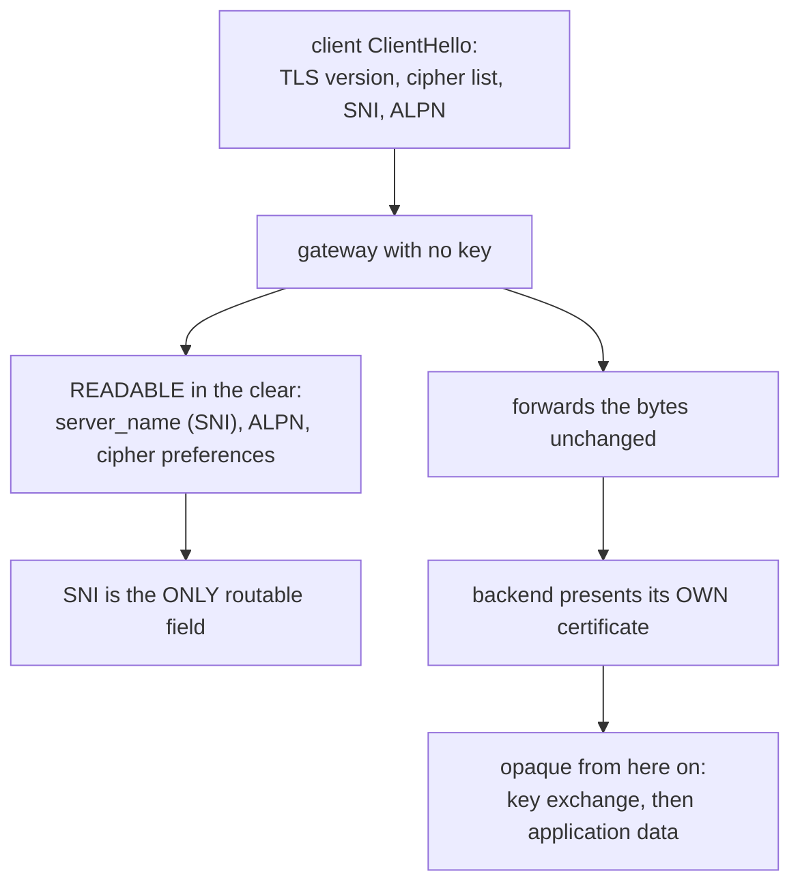

# Part 1 — What a proxy can see in a TLS stream

> Prerequisite: [the module landing page](./course.md). Next: [Part 2 — Configuring passthrough](./course-02-configuring-passthrough.md).

Everything about passthrough configuration follows from one question: with no key, how much of a TLS connection can a proxy in the middle actually read? The answer is "the first message, and only parts of it" — and that is what decides which fields the routing rules can use.

## The handshake, from the middle



A passthrough gateway is a router with one field to route on. Everything a normal gateway does with paths and headers is unavailable, because it never holds a key.

The ClientHello is sent before any key material is agreed, so it is necessarily in the clear. Everything after the key exchange is not.

**SNI** — Server Name Indication — is in that first message for a reason unrelated to proxies: a server hosting several sites needs to know which certificate to present *before* it can present one, and the certificate has to go out before the client can say anything encrypted. So the hostname is declared up front, in plaintext, by design.

A proxy that cannot decrypt gets to use that, and nothing else. No method, no path, no headers, no body, no response code. Which gives the constraint the rest of the module elaborates: **passthrough routing matches on SNI, because SNI is the only thing there is.**

Two things worth knowing about the edges of that statement:

- **ALPN is readable too**, and is how a proxy can tell an HTTP/2 connection from HTTP/1.1 without decrypting. Istio does not expose it as a `VirtualService` match, but it explains how a passthrough listener can still make protocol-level decisions.
- **Encrypted ClientHello (ECH)** is a TLS extension that hides SNI as well. Where it is in use, SNI-based routing stops working — worth knowing the direction the standards are moving, not something to plan around today.

## Terminate or forward: the whole difference

| | Terminated (`SIMPLE` / `MUTUAL`) | Passthrough |
| --- | --- | --- |
| Gateway holds a certificate | yes, via `credentialName` | **no** |
| Who completes the handshake | the gateway | the **backend** |
| `VirtualService` section | `http` | `tls` |
| Matches on | `uri`, `headers`, `method`, … | `sniHosts`, `port` |
| Gateway can see the request | yes | no |
| L7 telemetry and policy at the edge | available | **not available** |
| Client certificate reaches the backend | only as a forwarded header | as the real certificate |

The last row is the one that usually decides the choice. A backend that authenticates its callers by client certificate needs the actual certificate, not a gateway's summary of one — and a gateway that terminated the connection cannot provide it.

## The backend owns the certificate

In this module, the certificate is not yours and is not in `istio-system`. The playground's `tls-backend` generates its own at startup and serves HTTPS directly on port `8443`.

That is worth confirming before any gateway exists, because it makes the later result unambiguous: if the certificate you see through the gateway is the same one the backend serves directly, nothing in between re-created it.

> [!TIP]
> **Try it — the backend serving its own TLS, with no gateway involved**
>
> ```sh
> kubectl -n passthrough-demo get pods,svc
> kubectl -n passthrough-demo port-forward svc/tls-backend 9443:8443 >/dev/null 2>&1 &
> sleep 2
> curl -sk -v https://localhost:9443/ 2>&1 | grep -E 'subject:|issuer:|^\{|backend'
> ```
>
> Expect something like:
>
> ```text
> * subject: CN=secure.ica.local; O=backend
> * issuer: CN=secure.ica.local; O=backend
> backend terminated TLS
> ```
>
> Stop the port-forward with `kill %1`. `O=backend` is the organisation this nginx put in the certificate it generated for itself when the pod started — no Kubernetes Secret and no Istio object was involved in creating it. Note also that this works *through the pod's sidecar*: the sidecar forwards the TLS stream to the container without decrypting it, for exactly the same reason the gateway will.

Keep that subject line. [Part 3](./course-03-what-passthrough-costs.md) compares it against what a client sees through the gateway, and identical output is the proof that passthrough did what it claims.

> *The ClientHello is in the clear and everything after it is not, so a proxy without the key can route on SNI and on nothing else.*

## Common pitfalls

> [!WARNING]
> **Expecting path or header routing in passthrough.** The proxy never decrypts, so SNI is the only thing it can route on.
>
> **Assuming the gateway's certificate is presented.** In passthrough the *backend's* certificate reaches the client.
>
> **Reading passthrough as more secure by default.** It moves termination, and the responsibility, to the backend.
>
> **Forgetting telemetry goes with it.** No HTTP is parsed, so there are no HTTP metrics or access-log fields for that traffic.

## Reference

- [RFC 6066 §3 — Server Name Indication](https://datatracker.ietf.org/doc/html/rfc6066#section-3) — why SNI is sent in the clear and what it contains.
- [Envoy TLS inspector](https://www.envoyproxy.io/docs/envoy/latest/configuration/listeners/listener_filters/tls_inspector) — the listener filter that reads SNI and ALPN without terminating.
- [Ingress gateway without TLS termination](https://istio.io/latest/docs/tasks/traffic-management/ingress/ingress-sni-passthrough/) — Istio's own passthrough task, which this module follows.
