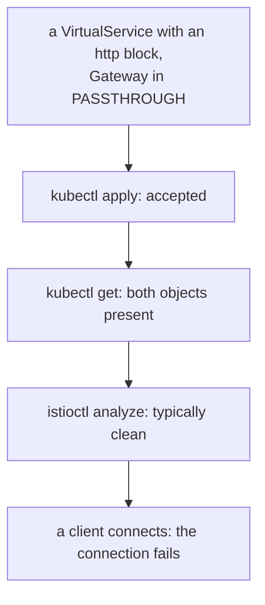

# Part 2 — Configuring passthrough

> Prerequisite: [Part 1 — What a proxy can see in a TLS stream](./course-01-what-a-proxy-can-see.md). Next: [Part 3 — What passthrough costs](./course-03-what-passthrough-costs.md).

Two objects, and both differ from [Module 1](../module-01/course.md) in a way that follows directly from "the gateway cannot read this stream". This part writes them and names the mistake that produces a config which applies perfectly and works not at all.

## The `Gateway`: a listener that will not decrypt

```yaml
    - port:
        number: 443
        name: tls
        protocol: TLS
      hosts:
        - secure.ica.local
      tls:
        mode: PASSTHROUGH
```

Three differences from the `SIMPLE` listener, and each is a consequence rather than a convention:

- **`protocol: TLS`, not `HTTPS`.** `HTTPS` means *terminate, then treat the contents as HTTP*. `TLS` means *this is a TLS stream*, with no claim about what is inside. Pairing `protocol: HTTPS` with `mode: PASSTHROUGH` asks the gateway to parse HTTP it has no key for — the two halves contradict each other.
- **`name: tls`, not `https`.** From [Module 1](../module-01/course-02-the-tls-listener.md), the port-name prefix feeds protocol selection, so the name should agree with the protocol rather than fight it.
- **No `credentialName`.** There is nothing for the gateway to present. If you find yourself wanting to name a secret here, the design has drifted back to termination.

`hosts` still selects the listener by SNI, exactly as before — that mechanism never depended on decryption.

## The `VirtualService`: a `tls` block

```yaml
  tls:
    - match:
        - port: 443
          sniHosts:
            - secure.ica.local
      route:
        - destination:
            host: tls-backend
            port:
              number: 8443
```

A `tls` block, not an `http` block. A `VirtualService` has three possible routing sections, and which one applies is decided by what the proxy can see:

| Section | Matches on | Used when |
| --- | --- | --- |
| `http` | `uri`, `headers`, `method`, `queryParams`, … | the proxy terminated TLS, or the traffic is plaintext HTTP |
| `tls` | `sniHosts`, `port` | passthrough — SNI is all there is |
| `tcp` | `port` (and source labels) | opaque TCP with no SNI at all |

`sniHosts` must name the same hostname the `Gateway` lists in `hosts`, because both are matching the same value out of the same ClientHello. A mismatch of one character routes nothing.

And the destination port is the **backend's TLS port** — `8443` here, where nginx is listening with its own certificate. The gateway is opening a TCP connection to it and splicing the two streams; it is not making an HTTP request, so there is no plaintext port to target.

## The signature mistake

Writing an `http` block for passthrough traffic is the error this module exists to inoculate against, because of how it fails:



Every check short of real traffic says this is fine. An `http` block on a passthrough listener is a category error that nothing validates for you.

Every check passes and the traffic does not work. The reason is exactly [Part 1](./course-01-what-a-proxy-can-see.md)'s diagram: an `http` match needs a method, a path or a header, and the gateway has none of those — the bytes after the ClientHello are opaque. Nothing matches, so nothing routes.

The tell is the *shape* of the failure. A connection that fails during or just after the handshake, with no HTTP status, on a config that looks right, is almost always one of:

- an `http` block where a `tls` block was needed;
- `hosts` and `sniHosts` disagreeing;
- a client that sent no SNI at all.

All three are "the stream had nowhere to go", and none of them will produce a `404` or a `403`, because producing either would require reading the request.

## Putting it together

> [!TIP]
> **Try it — route an encrypted stream by SNI**
>
> ```sh
> kubectl apply -f - <<'YAML'
> apiVersion: networking.istio.io/v1
> kind: Gateway
> metadata:
>   name: passthrough-gateway
>   namespace: passthrough-demo
> spec:
>   selector:
>     istio: ingressgateway
>   servers:
>     - port:
>         number: 443
>         name: tls
>         protocol: TLS
>       hosts:
>         - secure.ica.local
>       tls:
>         mode: PASSTHROUGH
> ---
> apiVersion: networking.istio.io/v1
> kind: VirtualService
> metadata:
>   name: passthrough
>   namespace: passthrough-demo
> spec:
>   hosts:
>     - secure.ica.local
>   gateways:
>     - passthrough-gateway
>   tls:
>     - match:
>         - port: 443
>           sniHosts:
>             - secure.ica.local
>       route:
>         - destination:
>             host: tls-backend
>             port:
>               number: 8443
> YAML
>
> kubectl -n istio-system port-forward svc/istio-ingressgateway 8443:443 >/dev/null 2>&1 &
> sleep 2
> curl -sk --resolve secure.ica.local:8443:127.0.0.1 \
>   -o /dev/null -w 'passthrough: %{http_code}\n' https://secure.ica.local:8443/
> ```
>
> Expect something like:
>
> ```text
> passthrough: 200
> ```
>
> Stop the port-forward with `kill %1` afterwards. The `200` came from nginx inside the cluster, and the TLS session it came over was negotiated directly between your `curl` and that nginx — the gateway moved bytes between two sockets without being able to read them. `--resolve` is still essential, and for a sharper reason than in [Module 1](../module-01/course-02-the-tls-listener.md): here SNI is not merely how the listener is chosen, it is the *only* input the routing rule has.

One detail that often goes unremarked: the backend pod is in an injected namespace, so its sidecar is in the path too — and it forwards the TLS stream to the container without decrypting it, for the same reason the gateway does. Passthrough is end to end in the literal sense; no proxy anywhere on the path holds a key for this session.

> *`protocol: TLS` with `mode: PASSTHROUGH` and a `VirtualService` `tls` block go together — an `http` block applies cleanly and routes nothing, because there is no HTTP to match.*

## Common pitfalls

> [!WARNING]
> **Writing an `http` block for a passthrough listener.** It applies, validates and cannot work. Passthrough needs a `tls` block matching on `sniHosts`.
>
> **Omitting `sniHosts`.** It is the only thing a passthrough route can match on, and it is required.
>
> **Trusting `istioctl analyze` here.** This mismatch is typically not reported.
>
> **Expecting a useful error.** The symptom is a failed connection, not a message about the wrong block type.

## Reference

- [Ingress gateway without TLS termination](https://istio.io/latest/docs/tasks/traffic-management/ingress/ingress-sni-passthrough/) — Istio's passthrough task, with the same two objects.
- [VirtualService `TLSRoute`](https://istio.io/latest/docs/reference/config/networking/virtual-service/#TLSRoute) — the `tls` section and `sniHosts`.
- [`ServerTLSSettings`](https://istio.io/latest/docs/reference/config/networking/gateway/#ServerTLSSettings-TLSmode) — the `TLSmode` enum, including `PASSTHROUGH` and `AUTO_PASSTHROUGH`.
