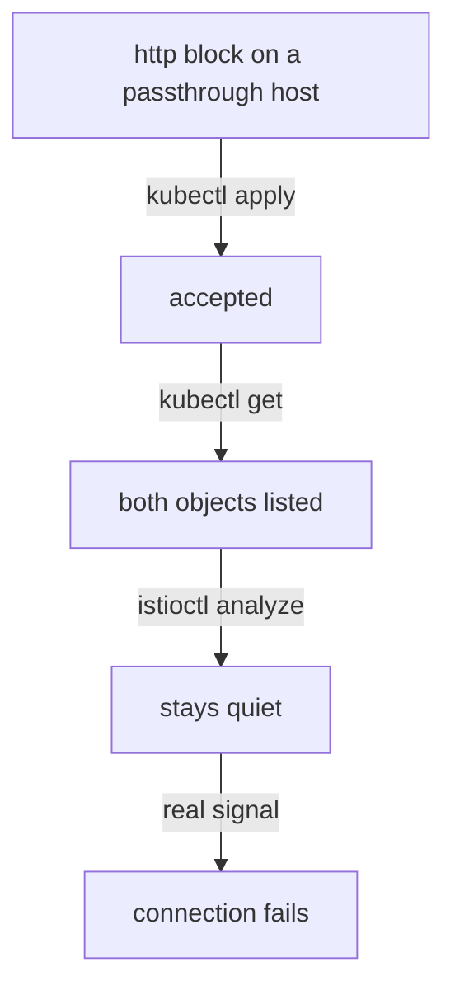

# When The Stream Has Nowhere To Go

Astronaut, a wrong passthrough setup does not answer with a friendly `404` or `403`. To send either code, the gate would have to read the request, and it cannot. So every mistake looks the same from outside: the connection simply ends. This part breaks the vault's setup three ways on purpose, so you can tell the causes apart when it happens by accident.

The commands below start from the working setup: the `Gateway` `vault-gateway` and the `VirtualService` `tls-backend` in `starfleet`, saved as `gateway-vault.yaml` and `virtualservice-tls-backend.yaml`.

## Mistake 1: an `http` block

This is the signature mistake of passthrough, because every check short of real traffic says it is fine.



The object is accepted and listed, and `istioctl analyze` says nothing. Only a real signal, or the gate's own listener, shows the problem.

<!-- astrona:playground:renew -->

### Break it

Save this as `virtualservice-tls-backend-http.yaml`. It is the same flight plan, written as an `http` block:

```yaml
apiVersion: networking.istio.io/v1
kind: VirtualService
metadata:
  name: tls-backend
  namespace: starfleet
spec:
  hosts:
  - vault.starfleet.example.com
  gateways:
  - vault-gateway
  http:
  - route:
    - destination:
        host: tls-backend
        port:
          number: 8443
```

Apply it:

```sh
kubectl apply -f virtualservice-tls-backend-http.yaml
```

```text
virtualservice.networking.istio.io/tls-backend configured
```

`kubectl apply` replaced the `tls` block: it removes fields that were in the last applied file and are missing from the new one. Wait about a minute, then check the result and ask `istioctl analyze`:

```sh
tls_status vault.starfleet.example.com
istioctl analyze -n starfleet
```

```text
000

✔ No validation issues found when analyzing namespace: starfleet.
```

`000`: the connection ended during the handshake, and `istioctl analyze` found nothing wrong. Now ask the gate itself:

```sh
istioctl proxy-config listener deploy/istio-ingress -n istio-ingress --port 443
```

```text
ADDRESSES PORT MATCH DESTINATION
```

Only the header row is left: the gate has no listener on port `443` at all any more. A passthrough server can only be served by a `tls` rule. An `http` rule needs a method, a path or a header, and the gate can read none of them in a sealed stream. So mission control (`istiod`) builds nothing for the host, and the stream has nowhere to go.

Put the working flight plan back:

```sh
kubectl apply -f virtualservice-tls-backend.yaml
```

```text
virtualservice.networking.istio.io/tls-backend configured
```

## Mistake 2: the gate listens for another host

The `Gateway`'s `hosts` and the `VirtualService`'s `sniHosts` both read the same SNI name. If they disagree, the gate picks no route for the name the visitor sends.

### Break it

Save this as `gateway-vault-typo.yaml`. The host is missing one letter:

```yaml
apiVersion: networking.istio.io/v1
kind: Gateway
metadata:
  name: vault-gateway
  namespace: starfleet
spec:
  selector:
    istio: ingress
  servers:
  - port:
      number: 443
      name: tls
      protocol: TLS
    hosts:
    - valt.starfleet.example.com
    tls:
      mode: PASSTHROUGH
```

Apply it:

```sh
kubectl apply -f gateway-vault-typo.yaml
```

```text
gateway.networking.istio.io/vault-gateway configured
```

Wait about a minute. Then check the result, read the gate's port 443 listener, and ask `istioctl analyze`:

```sh
tls_status vault.starfleet.example.com
istioctl proxy-config listener deploy/istio-ingress -n istio-ingress --port 443
istioctl analyze -n starfleet
```

```text
000
ADDRESSES PORT MATCH DESTINATION
Warning [IST0132] (VirtualService starfleet/tls-backend) one or more host [vault.starfleet.example.com] defined in VirtualService starfleet/tls-backend not found in Gateway starfleet/vault-gateway.
```

The visitor sent `vault.starfleet.example.com`, but the gate's server now waits for `valt.starfleet.example.com`. Your `VirtualService` no longer fits any host on `vault-gateway`, so mission control drops it, and once more the gate has no listener on port `443`. This time `istioctl analyze` does notice: warning `IST0132` says the `VirtualService`'s host is not found in the `Gateway`. `istioctl analyze` still ends with exit code `0` on a warning, so read its output, not its exit code.

Istio also checks, when you apply a `VirtualService`, that each name in `sniHosts` is one of that `VirtualService`'s own `hosts`. We tried `sniHosts` with another host, and the validation webhook refused it with `SNI host "other.starfleet.example.com" is not a compatible subset of any of the virtual service hosts`. A mismatch between the `Gateway` and the `VirtualService` is not checked at apply time, which is why this mistake gets through.

Put the working `Gateway` back, and wait about a minute before the next test:

```sh
kubectl apply -f gateway-vault.yaml
```

```text
gateway.networking.istio.io/vault-gateway configured
```

## Mistake 3: no SNI at all

The setup can be perfect and still route nothing if the visitor sends no SNI name. That happens when you connect to an IP address, or with a client that leaves SNI out.

### Connect by address only

Send one signal to `127.0.0.1` with no host name:

```sh
curl -sk -o /dev/null -w "%{http_code}\n" https://127.0.0.1:8443/
```

```text
000
```

The failed signal makes the port forward restart, so wait about ten seconds. Then try a handshake with `openssl` and no SNI, and keep the first five lines:

```sh
openssl s_client -connect 127.0.0.1:8443 -noservername </dev/null 2>&1 | head -5
```

```text
Connecting to 127.0.0.1
805E85F401000000:error:0A000126:SSL routines::unexpected eof while reading:ssl/record/rec_layer_s3.c:703:
CONNECTED(00000003)
---
no peer certificate available
```

Both fail. The gate closed the connection without a word (`unexpected eof`), and no ship showed a certificate (`no peer certificate available`). The envelope has no address on it, so the routing rule has no input at all. This is a fault in the test, not in the setup. Always test with `--resolve` or with a real DNS name.

## Reading the shape of the failure

All three mistakes end the same way, so read the shape of the failure, not just the code:

| What you see | Most likely cause | Where to look |
| --- | --- | --- |
| `000`, no port 443 listener, `analyze` quiet | `http` block instead of `tls` | the `VirtualService` |
| `000`, no port 443 listener, `analyze` warns `IST0132` | `hosts` and `sniHosts` disagree | the `Gateway` `hosts` |
| `000` only when you connect by IP | no SNI sent | your test command |
| `200`, but the certificate is not the ship's | the gate ended TLS (`HTTPS` or a `credentialName`) | the `Gateway` server |

None of these gives a `404` or a `403`. Either code would need the gate to read the request.

> [!TIP]
> When a passthrough host gives `000`, read the gate's port 443 listener first: `istioctl proxy-config listener deploy/istio-ingress -n istio-ingress --port 443`. If the SNI name is not in the `MATCH` column (or the listener is not there at all), the gate cannot route it, whatever the objects look like.

## Common pitfalls

> [!WARNING]
> - **Trusting `kubectl apply` and `istioctl analyze`.** An `http` block on a passthrough host applies cleanly and `analyze` stays quiet. Only a real signal or the gate's listener shows it fails.
> - **Testing again too fast.** After a failed signal the `8443` port forward restarts, and the next signal fails for a few seconds. Wait about ten seconds.
> - **Waiting for a `404` or `403`.** A broken passthrough setup ends the connection; it never sends an HTTP code.
> - **Fixing the setup when the test is wrong.** A signal sent to an IP address carries no SNI name and fails with any setup.
> - **Changing only one side of a host name.** `Gateway` `hosts` and `VirtualService` `sniHosts` must name the same host.

> *A passthrough mistake never sends an error page: the stream just has nowhere to go, so read the gate's listener, not the status code.*

## Your mission: Fix The Gate That Routes Nothing

You can now tell an `http` block, a host mismatch and a missing SNI name apart, and find each one in the gate's listener. Now prove it in a graded mission: the vault's passthrough setup in the Starfleet applies cleanly but routes nothing, and you have to find and fix every fault.

The mission runs in its own training solar system, so first pause your playground. Nothing in it is lost:

```sh
astrona stop ats-015-playground-040-03
```

Then start the mission:

```sh
astrona run --git git@github.com:astrona-io/ATS015.git -c sections/section-040/module-03/labs/lab-02
```

Read the task in [`question.md`](./labs/lab-02/question.md) and solve it on your own first. When you think you are done, send it for grading:

```sh
astrona submit -c sections/section-040/module-03/labs/lab-02
```

When the mission is done, remove it and wake your playground up again:

```sh
astrona destroy ats-015-lab-040-03-02
astrona start ats-015-playground-040-03
```
