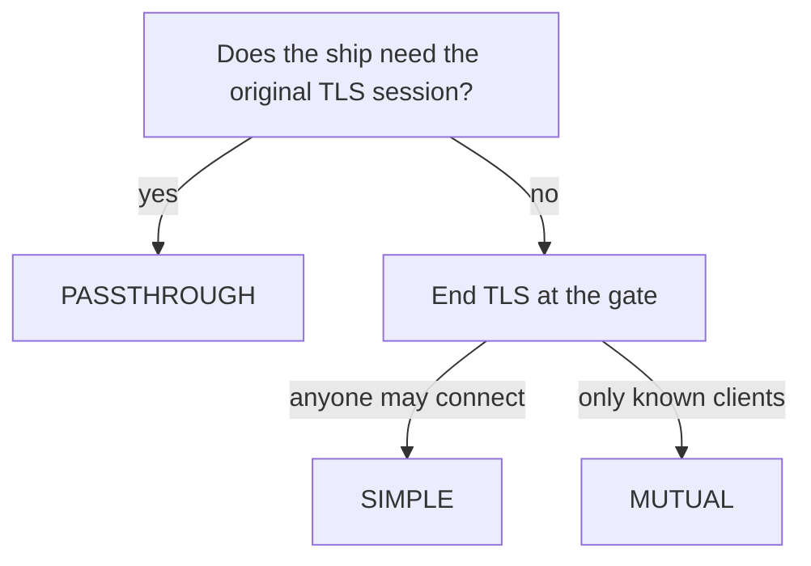

# One Gate, Two Modes

Astronaut, a real gate rarely serves only sealed ships. Most hosts are better off when the gate opens the signal, and only a few must stay sealed. This part puts both on the same gate: the bridge, which the gate opens with its own certificate, and the vault, which the gate passes through. Seeing them side by side makes the cost of passthrough concrete, and leads to one simple question for choosing a mode.

The commands below need the vault's passthrough setup applied: the `Gateway` `vault-gateway` and the `VirtualService` `tls-backend` in `starfleet`.

## Give the gate its own badge

To end TLS itself, the gate needs a certificate and its private key: its own badge and key, kept in the gate's safe. In Istio that safe is a Kubernetes Secret, and the gate reads it from **its own namespace**, here `istio-ingress`.

<!-- astrona:playground:renew -->

### Make a certificate with openssl

Make a self-signed certificate for `starfleet.example.com` on your own machine. `-addext` writes the host name into the certificate's SAN (Subject Alternative Name) field, the name that clients check:

```sh
openssl req -x509 -newkey rsa:2048 -nodes -days 365 \
  -subj "/CN=starfleet.example.com/O=starfleet-gate" \
  -addext "subjectAltName=DNS:starfleet.example.com" \
  -keyout starfleet.key -out starfleet.crt
```

`openssl` prints a few lines of dots and plus signs while it makes the key, then `-----`. After that the files `starfleet.key` and `starfleet.crt` are in your current folder.

### Put it in the gate's safe

Store the certificate and key as a TLS Secret next to the gate:

```sh
kubectl create secret tls starfleet-credential -n istio-ingress \
  --cert=starfleet.crt --key=starfleet.key
```

```text
secret/starfleet-credential created
```

## Open the bridge's signals at the gate

The bridge already has a `Gateway`, `starfleet-gateway`, with a plain HTTP server on port `80`. Add a second server on port `443` that ends TLS with the new Secret.

### Add an HTTPS server

Save this as `gateway-starfleet.yaml`:

```yaml
apiVersion: networking.istio.io/v1
kind: Gateway
metadata:
  name: starfleet-gateway
  namespace: starfleet
spec:
  selector:
    istio: ingress
  servers:
  - port:
      number: 80
      name: http
      protocol: HTTP
    hosts:
    - starfleet.example.com
  - port:
      number: 443
      name: https
      protocol: HTTPS
    hosts:
    - starfleet.example.com
    tls:
      mode: SIMPLE
      credentialName: starfleet-credential
```

Apply it:

```sh
kubectl apply -f gateway-starfleet.yaml
```

```text
gateway.networking.istio.io/starfleet-gateway configured
```

`mode: SIMPLE` means the gate ends TLS with the certificate named in `credentialName`. The bridge's `VirtualService` is already bound to `starfleet-gateway`, so its `http` rule now serves this HTTPS server too. Nothing else needs to change.

### Compare the two hosts

Wait about a minute for the gate to load its new certificate. Then send one signal to each host on the same port, and ask which certificate each one gets:

```sh
tls_status starfleet.example.com /productpage
tls_status vault.starfleet.example.com
show_certificate starfleet.example.com
show_certificate vault.starfleet.example.com
```

```text
200
200
subject=CN=starfleet.example.com, O=starfleet-gate
sha256 Fingerprint=2B:3D:A7:41:49:40:0B:4B:6E:2B:E9:85:4D:9B:BE:21:7C:2F:22:0D:1E:BC:51:A5:DC:7C:BB:26:C2:01:B1:AB
subject=CN=vault.starfleet.example.com, O=vault
sha256 Fingerprint=8D:AA:16:3B:52:67:DB:24:B8:5B:4E:2E:AA:B1:76:CB:C3:40:76:49:68:C5:F9:3C:ED:C7:33:B6:1B:95:05:B4
```

The same gate, on the same port `443`, hands out two different certificates. For `starfleet.example.com` it shows its own (`O=starfleet-gate`), because it ends TLS. For `vault.starfleet.example.com` the visitor gets the vault's (`O=vault`), because the gate passes the signal through. The gate picks between the two servers by the SNI name, at connection time.

### Look at the listener and the routes again

Read the gate's port 443 listener, then its HTTP routes:

```sh
istioctl proxy-config listener deploy/istio-ingress -n istio-ingress --port 443
istioctl proxy-config routes deploy/istio-ingress -n istio-ingress
```

```text
ADDRESSES PORT MATCH                            DESTINATION
0.0.0.0   443  SNI: starfleet.example.com       Route: https.443.https.starfleet-gateway.starfleet
0.0.0.0   443  SNI: vault.starfleet.example.com Cluster: outbound|8443||tls-backend.starfleet.svc.cluster.local
NAME                                            VHOST NAME                    DOMAINS                   MATCH                  VIRTUAL SERVICE
https.443.https.starfleet-gateway.starfleet     starfleet.example.com:443     starfleet.example.com     /productpage           bridge.starfleet
https.443.https.starfleet-gateway.starfleet     starfleet.example.com:443     starfleet.example.com     /static*               bridge.starfleet
http.80                                         starfleet.example.com:80      starfleet.example.com     /productpage           bridge.starfleet
http.80                                         starfleet.example.com:80      starfleet.example.com     /static*               bridge.starfleet
                                                backend                       *                         /stats/prometheus*     
                                                backend                       *                         /healthz/ready*        
```

One listener, two rows, picked by SNI. The bridge's row leads to an HTTP **route**, because the gate opens and reads those signals, and the route table now holds the bridge on port `443` too. The vault's row leads straight to a **cluster**, and the vault still has no route.

## What passthrough costs

The two hosts above sit side by side, but the gate can do far less for the vault. This section lists what goes and what you get in return.

### The two modes next to each other

| | Ended at the gate (`SIMPLE` or `MUTUAL`) | Passthrough |
| --- | --- | --- |
| Gate holds a certificate | yes, through `credentialName` | **no** |
| Who finishes the handshake | the gate | the **ship** |
| `VirtualService` section | `http` | `tls` |
| Matches on | `uri`, `headers`, `method` and more | `sniHosts`, `port` |
| Gate sees the request | yes | no |
| Client certificate reaches the ship | only as a header the gate adds | as the real certificate |

### What the gate can no longer do

For a passthrough host the gate cannot:

- route on `uri`, `headers`, `method` or `queryParams`;
- rewrite a path or a host, or redirect HTTP to HTTPS for that host;
- add, read or remove headers, including the tracing headers, so a trace breaks at this hop;
- report HTTP metrics: no response codes and no per-path timing. Only connection metrics such as `istio_tcp_connections_opened_total` and bytes sent remain. In our run the gate's `istio_requests_total` listed only the bridge, and its TCP connection counter listed the vault;
- apply retries, timeouts, fault injection or any other `http` rule;
- apply an `AuthorizationPolicy` rule that checks `methods`, `paths` or other request fields. Rules on the connection still work: source IP blocks and destination ports.

### What you get in return

- The visitor and the ship share a TLS session that nothing in between can read.
- The ship shows its own certificate, which is what a visitor that pins that certificate expects.
- A ship that checks its visitors' client certificates gets the **real** certificate, not a summary in a header.

## Choosing a mode

The choice comes down to one question: **does the ship need the original TLS session?**



If the ship must show its own certificate, check client certificates itself, or a rule forbids anyone in the middle from decrypting, use passthrough. Otherwise end TLS at the gate: `SIMPLE` when the clients are the public, `MUTUAL` when the gate must also see a client certificate from a short, known list.

Ending TLS at the gate is the better default when nothing forces you otherwise. It gives you routing, flight logs, retries and one place to manage certificates. Passthrough trades all of that for a session no one in the middle can read. The mode is set per server, not per gate, so you choose it once per host.

One related mode has a similar name: **`AUTO_PASSTHROUGH`**. It routes on the SNI name without any `VirtualService`. It exists for gates between clusters in a multicluster mesh, where the SNI name itself encodes the destination Service. It is not meant for ordinary ingress.

## Common pitfalls

> [!WARNING]
> - **Putting the Secret in the wrong namespace.** The gate reads `credentialName` from its own namespace, here `istio-ingress`, not from `starfleet`.
> - **Expecting HTTP features on a passthrough host.** Path routing, header changes, retries, HTTP metrics and request-level authorization are all gone for it.
> - **Choosing passthrough "to be safe".** It moves the work of ending TLS to the ship. Choose it only when the ship needs the original session.
> - **Mixing up `PASSTHROUGH` and `AUTO_PASSTHROUGH`.** Ingress uses `PASSTHROUGH` with a `VirtualService`. `AUTO_PASSTHROUGH` is for gates between clusters.

> *Passthrough trades every HTTP feature at the gate for a session no one in the middle can read, and the certificate the visitor gets shows which side of that trade a host is on.*
