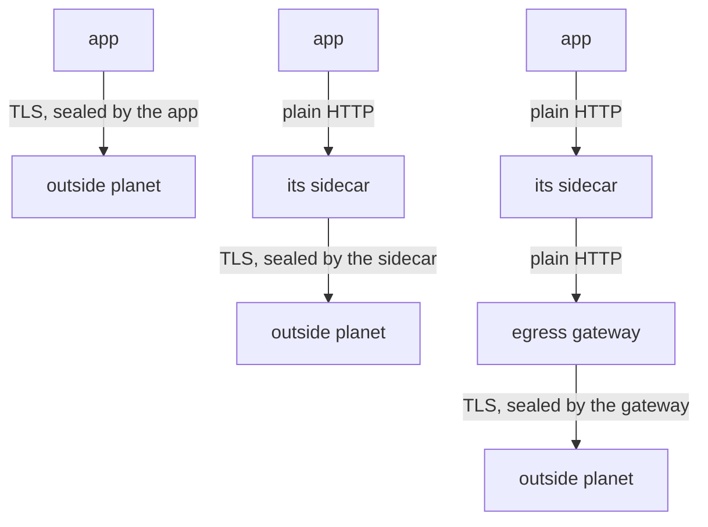

# Who Seals The Signal

Astronaut, before you change anything, look at the problem closely. This part shows what the communications officer (the sidecar proxy) can see when the app seals its own signal, and where else the seal could be added.

## What the sidecar sees in a sealed signal

When the app calls `https://`, the app itself starts the TLS session with the outside server. The sidecar is not part of that session. It sees a sealed envelope moving past, and it can only read the outside of it:

| Visible to the sidecar | Not visible |
| --- | --- |
| the destination address and port | the HTTP method |
| the server name written on the envelope (SNI) | the path |
| how many bytes moved, and for how long | the request and response headers |
| whether the connection worked | the status code and the body |

**SNI** (Server Name Indication) is the host name the client writes in plain text at the start of the TLS handshake, so the server knows which certificate to show. It is the one useful thing the sidecar can read in a sealed signal.

Almost every Istio traffic feature works on single requests: timeouts, retries, routing by path or header, fault injection, and per-request flight log lines. In a sealed signal there are no requests the sidecar can see, so none of those features can work.

## See it in your playground

First paste two helpers into your terminal. The first prints the status code and the time of one signal from the shuttle. The second waits two seconds and prints the last line of the shuttle's flight log.

<!-- astrona:playground:renew -->

```sh
status_and_time() { kubectl exec -n starfleet deploy/shuttle -- curl -s -o /dev/null -w "%{http_code} %{time_total}s\n" --max-time 10 "$@"; }
last_log_line() { sleep 2; kubectl logs -n starfleet deploy/shuttle -c istio-proxy --tail=1; }
```

These are shell functions. Paste them once in each new terminal, then call them by name. The sidecar writes its flight log in small batches, so `last_log_line` waits two seconds first. If the line it shows is an older one, run it again.

### Send a sealed signal

Send one HTTPS signal from the shuttle to `httpbin.org`, then read the flight log:

```sh
status_and_time https://httpbin.org/get
last_log_line
```

```
200 0.510294s
[2026-10-09T10:46:44.121Z] "- - -" 0 - - - "-" 901 4875 599 - "-" "-" "-" "-" "100.51.105.232:443" PassthroughCluster 10.244.0.6:40062 100.51.105.232:443 10.244.0.6:40058 - -
```

The call worked, but the log line has `"- - -"` where the method, path and protocol should be, and `0` where the status code should be. The sidecar only counted bytes. `PassthroughCluster` means it let the signal through to a planet that is not on its star chart. The address `"100.51.105.232:443"` is the server httpbin.org sent you to; yours may differ, because httpbin.org has several addresses.

### Ask the server how it was reached

httpbin.org echoes back the address it was reached on, including the scheme (`http` or `https`), in the `"url"` field of its answer. Now send a plain HTTP signal and read that field:

```sh
kubectl exec -n starfleet deploy/shuttle -- curl -s http://httpbin.org/get | grep '"url"'
```

```
  "url": "http://httpbin.org/get"
```

Today the shuttle's plain HTTP signal crosses the internet unsealed, and the server says so: `http://`. Watch this `"url"` field through the whole module. It is the outside server's own report of how the signal arrived.

## Three places to add the seal

There are three places where the TLS seal can be put on a signal that leaves the solar system:



The diagram shows three arrangements, top to bottom: the app seals the signal itself, its own sidecar seals it, or an egress gateway (the departure gate of the solar system) seals it. This module is about the middle one, **TLS origination at the sidecar**.

In the middle arrangement, the only unsealed hop is between the app and its own sidecar. Both sit in the same pod and talk over the pod's internal loopback connection, so nothing unsealed leaves the ship.

The price is one change in the app: **it must call `http://`, not `https://`**. If it keeps calling `https://`, the sidecar sees a sealed envelope again.

## The `tls` modes of a `DestinationRule`

The sealing order comes from a `DestinationRule`, in its `tls` block. Its `mode` always describes what the **client side sends**, that is, how this sidecar connects to the destination. There are four modes:

| `tls.mode` | What the sidecar does |
| --- | --- |
| `DISABLE` | Sends the signal without TLS |
| `SIMPLE` | Starts a normal one-way TLS connection, like a web browser: it checks the server's certificate |
| `MUTUAL` | Like `SIMPLE`, and also shows a client certificate you supply, so both sides check each other |
| `ISTIO_MUTUAL` | Uses the mesh's own secret handshake (mTLS) with the certificates Istio issues. Only for destinations inside the mesh |

An outside planet has no Istio certificate, so `ISTIO_MUTUAL` is never the right mode for it. Ordinary HTTPS to a public server is `SIMPLE`.

## Common pitfalls

> [!WARNING]
> - **Expecting timeouts, retries or routing on a signal the app sealed.** The sidecar sees encrypted bytes. It can read the SNI name and nothing else.
> - **Calling the open first hop a weakness.** It stays inside the pod, between the app and its own sidecar. Nothing unsealed leaves the ship.
> - **Forgetting that the app must change.** It has to call `http://` and let its sidecar add the seal.
> - **Reading `tls.mode` as the server's setting.** In a `DestinationRule` it is always what the client side sends.

> *When the app seals its own signal, its communications officer can only count bytes. The `"- - -"` in the flight log is the sign.*
