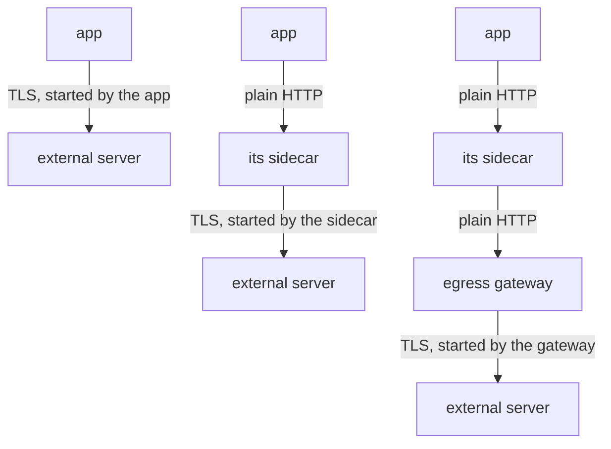

# Who Starts The TLS Connection

Most services on the internet only accept HTTPS, so a request that leaves your cluster must be encrypted with TLS (Transport Layer Security). Someone has to start that TLS connection. If the app does it, Istio loses sight of the request: the sidecar proxy (Envoy), the proxy container Istio adds to each pod, only sees encrypted bytes moving past.

This chapter looks at that problem before you change anything. You will see what the sidecar can and cannot read in an encrypted connection, send a real request to prove it, and then meet the three places where TLS can be started and the `tls` modes that control it.

## What the sidecar sees in an encrypted request

When the app calls `https://`, the app itself starts the TLS session with the outside server. The sidecar is not part of that session. It sees encrypted bytes moving past, and it can only read the unencrypted parts of the connection:

| Visible to the sidecar | Not visible |
| --- | --- |
| the destination address and port | the HTTP method |
| the server name the client sends in the handshake (SNI) | the path |
| how many bytes moved, and for how long | the request and response headers |
| whether the connection worked | the status code and the body |

The one useful name in that left column is the SNI. **SNI** (Server Name Indication) is the host name the client writes in plain text at the start of the TLS handshake, so the server knows which certificate to show. It is the only thing the sidecar can read about where an encrypted connection is going.

That gap matters because almost every Istio traffic feature works on single requests: timeouts, retries, routing by path or header, fault injection, and per-request access log lines. In an encrypted connection there are no requests the sidecar can see, so none of those features can work.

You can see this gap in your own playground. To keep the commands short, first paste two helpers into your terminal. The first prints the status code and the time of one request from the `shuttle` pod. The second waits two seconds and prints the last line of the `shuttle` pod's access log, the file where the sidecar writes one line for each request or connection.

<!-- astrona:playground:renew -->

```sh
status_and_time() { kubectl exec -n starfleet deploy/shuttle -- curl -s -o /dev/null -w "%{http_code} %{time_total}s\n" --max-time 10 "$@"; }
last_log_line() { sleep 2; kubectl logs -n starfleet deploy/shuttle -c istio-proxy --tail=1; }
```

These are shell functions, so paste them once in each new terminal and then call them by name. The sidecar writes its access log in small batches, which is why `last_log_line` waits two seconds first. If the line it shows is an older one, run it again.

Now send one HTTPS request from the `shuttle` pod to `httpbin.org`, then read the access log:

```sh
status_and_time https://httpbin.org/get
last_log_line
```

```
200 0.510294s
[2026-10-09T10:46:44.121Z] "- - -" 0 - - - "-" 901 4875 599 - "-" "-" "-" "-" "100.51.105.232:443" PassthroughCluster 10.244.0.6:40062 100.51.105.232:443 10.244.0.6:40058 - -
```

The call worked, but the log line has `"- - -"` where the method, path and protocol should be, and `0` where the status code should be. The sidecar only counted bytes. `PassthroughCluster` means it let the connection through to a host that is not in its service registry. The address `"100.51.105.232:443"` is the server httpbin.org sent you to; yours may differ, because httpbin.org has several addresses.

The access log is the sidecar's view. You also need the server's view, because it tells you how the request really arrived. httpbin.org echoes back the address it was reached on, including the scheme (`http` or `https`), in the `"url"` field of its response. Send a plain HTTP request and read that field:

```sh
kubectl exec -n starfleet deploy/shuttle -- curl -s http://httpbin.org/get | grep '"url"'
```

```
  "url": "http://httpbin.org/get"
```

Today the `shuttle` pod's plain HTTP request crosses the internet unencrypted, and the server says so: `http://`. Watch this `"url"` field through the whole module. It is the outside server's own report of how the request arrived.

## Three places to start TLS

So the app can encrypt and hide the request, or send plain HTTP and expose it on the internet. Neither is good. The way out is to start TLS somewhere else, and there are three places where TLS can be started for a request that leaves the cluster:



The diagram shows three arrangements, top to bottom: the app starts TLS itself, its own sidecar starts it, or an egress gateway starts it. An egress gateway is an Envoy proxy at the edge of the mesh that all outgoing traffic can be sent through. This module is about the middle one, **TLS origination at the sidecar**.

In the middle arrangement, the only unencrypted hop is between the app and its own sidecar. Both sit in the same pod and talk over the pod's internal loopback connection, so nothing unencrypted leaves the pod.

The price is one change in the app: **it must call `http://`, not `https://`**. If it keeps calling `https://`, the sidecar sees only encrypted bytes again.

## The `tls` modes of a `DestinationRule`

Once the app calls `http://`, the sidecar needs an instruction to start TLS. That instruction comes from a `DestinationRule`, the object that sets the traffic policy for one destination, in its `tls` block. Its `mode` always describes what the **client side sends**, that is, how this sidecar connects to the destination. There are four modes:

| `tls.mode` | What the sidecar does |
| --- | --- |
| `DISABLE` | Sends the request without TLS |
| `SIMPLE` | Starts a normal one-way TLS connection, like a web browser: it checks the server's certificate |
| `MUTUAL` | Like `SIMPLE`, and also shows a client certificate you supply, so both sides check each other |
| `ISTIO_MUTUAL` | Uses the mesh's own mutual TLS (mTLS) with the certificates Istio issues. Only for destinations inside the mesh |

An external server has no Istio certificate, so `ISTIO_MUTUAL` is never the right mode for it. Ordinary HTTPS to a public server is `SIMPLE`.

You now know why an app that encrypts on its own hides its requests from Istio: the sidecar can count bytes and read the SNI name, and that is all. The `"- - -"` in the access log is the sign. You also know where the fix lives: the app calls `http://`, and its sidecar starts TLS in `SIMPLE` mode. What is still open is how to tell the sidecar which host and port to do that for.

## Common pitfalls

> [!WARNING]
> - **Expecting timeouts, retries or routing on a request the app encrypted.** The sidecar sees encrypted bytes. It can read the SNI name and nothing else.
> - **Calling the open first hop a weakness.** It stays inside the pod, between the app and its own sidecar. Nothing unencrypted leaves the pod.
> - **Forgetting that the app must change.** It has to call `http://` and let its sidecar start TLS.
> - **Reading `tls.mode` as the server's setting.** In a `DestinationRule` it is always what the client side sends.
