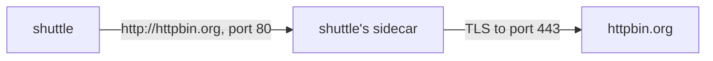

# Chart The Planet And Seal The Signal

Astronaut, TLS origination needs two Istio objects, and each one does one half of the job. You add them one at a time here, and after each one you send a signal to see what changed. The half-done stage has its own symptom, and you will meet it again whenever one half is missing.



The diagram shows the goal. The shuttle sends a readable signal to its own sidecar on port `80`. The sidecar seals it and sends it on to port `443` of the real server. Two settings make the right-hand arrow work:

- **`ServiceEntry` port `80` with `targetPort: 443`** decides **where** the sidecar connects: "signals the app sends to port 80 go to port 443 on the real server".
- **`DestinationRule` `tls.mode: SIMPLE` for port `80`** decides **how** it connects: "start a normal TLS connection".

## Before you send anything

The commands below use two helpers. Paste them into your terminal if you have not yet. The first prints the status code and the time of one signal from the shuttle. The second waits two seconds and prints the last line of the shuttle's flight log.

<!-- astrona:playground:renew -->

```sh
status_and_time() { kubectl exec -n starfleet deploy/shuttle -- curl -s -o /dev/null -w "%{http_code} %{time_total}s\n" --max-time 10 "$@"; }
last_log_line() { sleep 2; kubectl logs -n starfleet deploy/shuttle -c istio-proxy --tail=1; }
```

## Half done: chart the planet

A `ServiceEntry` adds a planet from another solar system to the star chart. For origination it needs **two** ports. Port `80` with protocol `HTTP` is where the app's plain signal arrives, so the sidecar knows it can read it. Port `443` with protocol `HTTPS` keeps the app's own `https://` calls working as before.

The key field is `targetPort` on port `80`. The app still calls port `80`, but the sidecar connects to port `443` on the real server.

### Add httpbin.org to the star chart

Save this as `serviceentry-httpbin-org.yaml`:

```yaml
apiVersion: networking.istio.io/v1
kind: ServiceEntry
metadata:
  name: httpbin-org
  namespace: starfleet
spec:
  hosts:
  - httpbin.org
  ports:
  - number: 80
    name: http
    protocol: HTTP
    targetPort: 443
  - number: 443
    name: https
    protocol: HTTPS
  location: MESH_EXTERNAL
  resolution: DNS
```

`location: MESH_EXTERNAL` says the planet is outside the mesh, so it has no sidecar of its own. `resolution: DNS` tells the sidecar to look up the address of `httpbin.org` itself.

Apply it:

```sh
kubectl apply -f serviceentry-httpbin-org.yaml
```

Then send a plain signal and read the flight log:

```sh
status_and_time http://httpbin.org/get
last_log_line
```

```
400 0.249537s
[2026-10-09T10:47:02.469Z] "GET /get HTTP/1.1" 400 - via_upstream - "-" 0 220 237 236 "-" "curl/8.11.1" "cd5fbb11-eac5-4eeb-8a4b-8820ef4f96cd" "httpbin.org" "98.89.203.252:443" outbound|80||httpbin.org 10.244.0.6:59970 54.159.186.149:80 10.244.0.6:58506 - default
```

If you still see `200`, the new orders have not reached the sidecar yet: wait a few seconds and send the signal again.

Two things changed. The log line is readable now: the sidecar knows port `80` carries HTTP, so it logs the method, the path and the status. The cluster `outbound|80||httpbin.org` is the port the shuttle called, and the upstream address `"98.89.203.252:443"` ends in `:443`, so `targetPort` worked. But the sidecar still speaks plain HTTP, and the server on port `443` expects TLS. So httpbin.org turns the signal down with `400`. Only half the job is done.

## Seal the signal

A `DestinationRule` holds the docking instructions for one destination. Its `tls` block with `mode: SIMPLE` makes the sidecar open a TLS connection, like a normal HTTPS client.

Put the `tls` block under `portLevelSettings` for port `80` only: that is the port the app's plain signal uses. Port `443` must stay as it is, because the app's own `https://` signals already arrive there sealed. The `sni` field is the server name the sidecar writes on the envelope. The sidecar is the TLS client now, so it names the server.

### Add the docking instructions

Save this as `destinationrule-httpbin-org.yaml`:

```yaml
apiVersion: networking.istio.io/v1
kind: DestinationRule
metadata:
  name: httpbin-org
  namespace: starfleet
spec:
  host: httpbin.org
  trafficPolicy:
    portLevelSettings:
    - port:
        number: 80
      tls:
        mode: SIMPLE
        sni: httpbin.org
```

Apply it:

```sh
kubectl apply -f destinationrule-httpbin-org.yaml
```

Then ask httpbin.org how it was reached, read the flight log, and check that the shuttle's own `https://` signals still work:

```sh
kubectl exec -n starfleet deploy/shuttle -- curl -s http://httpbin.org/get | grep '"url"'
last_log_line
status_and_time https://httpbin.org/get
```

```
  "url": "https://httpbin.org/get"
[2026-10-09T10:47:21.348Z] "GET /get HTTP/1.1" 200 - via_upstream - "-" 0 930 507 507 "-" "curl/8.11.1" "9cebb021-07e7-4778-8288-ca8223edd28f" "httpbin.org" "100.56.179.159:443" outbound|80||httpbin.org 10.244.0.6:36390 98.89.203.252:80 10.244.0.6:43762 - default
200 0.484647s
```

The shuttle sent `http://`, and httpbin.org says it was reached on `https://`. The shuttle's sidecar sealed the signal on the way out. The app's own `https://` call still answers `200`, because the `DestinationRule` did not touch port `443`.

## Proof from the proxy

The server's answer is one proof. The second proof is in the sidecar's own orders. Each port of `httpbin.org` is a **cluster** in the shuttle's proxy: a named destination it can send to. A cluster that seals its connections carries a **transport socket** named `envoy.transport_sockets.tls`, and it holds the `sni` name you set.

### Read the shuttle's clusters for httpbin.org

List the clusters, then look inside the one for port `80`:

```sh
istioctl proxy-config cluster deploy/shuttle -n starfleet --fqdn httpbin.org
istioctl proxy-config cluster deploy/shuttle -n starfleet --fqdn httpbin.org --port 80 -o json | grep -e '"name": "envoy.transport_sockets' -e '"sni"'
```

```
SERVICE FQDN     PORT     SUBSET     DIRECTION     TYPE           DESTINATION RULE
httpbin.org      80       -          outbound      STRICT_DNS     httpbin-org.starfleet
httpbin.org      443      -          outbound      STRICT_DNS     httpbin-org.starfleet
            "name": "envoy.transport_sockets.tls",
                "sni": "httpbin.org"
```

Both clusters use the `httpbin-org` `DestinationRule` in `starfleet`. `STRICT_DNS` means the sidecar looks up the address of `httpbin.org` itself, because of `resolution: DNS`. The port `80` cluster carries the TLS transport socket and the SNI name `httpbin.org`. That is the sidecar's order to seal every signal it sends there. If the second command prints nothing, the new orders have not reached the sidecar yet: wait a second and run it again.

## Common pitfalls

> [!WARNING]
> - **`targetPort` without the `DestinationRule`.** The sidecar sends plain HTTP to port `443`, and the server answers `400`.
> - **The `tls` block on port `443`.** The app's plain signal uses port `80`. Seal the port the app calls, not the port the server listens on.
> - **`tls` at the top of `trafficPolicy`.** It seals every port of the host, including `443`, so the app's own `https://` signals get a second seal and fail. When the course was tested, `curl https://httpbin.org/get` from the shuttle then failed with exit code `35` and `packet length too long`. Use `portLevelSettings`.
> - **Trusting a `200` alone.** Check the server's view (`"url": "https://..."`) and the port `80` cluster (`envoy.transport_sockets.tls`).

> *The `ServiceEntry` decides where the sidecar connects, and the `DestinationRule` decides how. You need both.*
