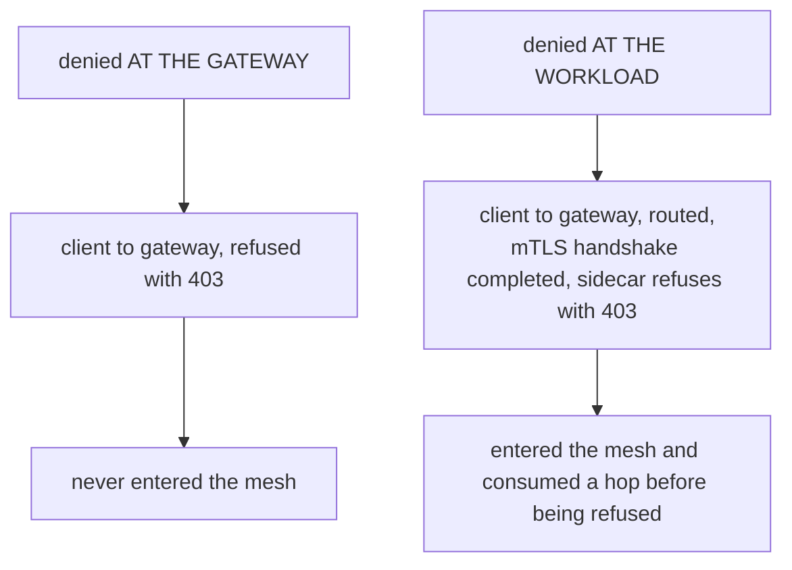

# Part 1 — Authorizing at the gateway, and the connection peer

> Prerequisite: [the module landing page](./course.md). Next: [Part 2 — `X-Forwarded-For` and trusted proxies](./course-02-trusting-x-forwarded-for.md).

Applying an `AuthorizationPolicy` to a gateway is the same object doing the same job one hop earlier. This part covers where it has to live, what moving the decision to the edge changes, and then the first of the two source-address fields — the one that means something different from what its name suggests.

## The same object, a different workload

```yaml
apiVersion: security.istio.io/v1
kind: AuthorizationPolicy
metadata:
  name: gateway-ip-allow
  namespace: istio-system          # ← the GATEWAY's namespace
spec:
  selector:
    matchLabels:
      istio: ingressgateway        # ← the GATEWAY pod's labels
  action: ALLOW
  rules:
    - from:
        - source:
            ipBlocks:
              - 10.0.0.0/8
```

Nothing structural is new. `selector` picks pods, `action` and `rules` behave exactly as in [section 020](../../section-020/module-01/course-04-identity-union-and-debugging.md), and the policy is compiled into the RBAC filter of the proxies it selects. The two values are what change: the namespace is the gateway's, and the selector matches the gateway pod rather than an application.

Placing it in the application's namespace is the usual mistake, and it behaves like every other misplaced policy in this course — accepted, applied, selecting nothing. The reason is mechanical rather than a special rule: a policy is delivered to the proxies its `selector` matches *within its own namespace*, and the gateway pod does not run in `gwauthz-demo`.

`istio: ingressgateway` is the label the `demo` profile puts on that pod. On a cluster someone else installed, confirm it rather than assuming:

```sh
kubectl -n istio-system get pods --show-labels | grep gateway
```

A gateway deployed with the Gateway API, or a second ingress gateway installed alongside the first, will carry different labels — and a selector matching nothing is invisible until traffic fails to be blocked.

## What moving the decision earlier buys

The same rule could be written on the application workload. Enforcing it at the gateway changes where a denied request stops:



Both return 403 to the caller. The difference is how much of your mesh the rejected request got to use first, which is the whole argument for authorizing at the edge as well as at the workload.

For a block-list this matters: abusive traffic is refused at the first thing it touches, rather than being carried through the mesh to be refused at the end. It is also the only place the rule *can* be written when the caller is external, because everything downstream sees the gateway as the client, not the original caller.

The cost is that the gateway is shared. A policy selecting `istio: ingressgateway` applies to **every** hostname that gateway serves, not just yours. Narrowing it to one application means adding `to.operation.hosts` or `paths` to the rule, and forgetting to do so is how a rule intended for one service quietly governs a dozen.

## `ipBlocks` is the connection peer

`ipBlocks` matches the **direct peer of the TCP connection** — whoever the gateway is actually talking to at the socket level. Not "the client", unless the client connected directly.

```text
   real user            cloud LB           gateway
   198.51.100.7  ──────▶ 203.0.113.4 ──────▶ sees peer = 203.0.113.4
                                             ipBlocks matches THIS
```

So behind a cloud load balancer, an ingress controller, a CDN or a service mesh gateway in front of this one, `ipBlocks` sees the intermediary — every single time, for every client. A rule allowing your office range then matches nothing, and a rule allowing the load balancer's range matches everyone who ever comes through it, which is worse: it looks like a working allow-list and enforces nothing.

The field is right when clients reach the gateway directly, and for internal ranges — a `NodePort` reached from inside the network, a gateway exposed only within a VPC.

The playground gives a small live demonstration of the general principle, because a `kubectl port-forward` is itself an intermediary.

> [!TIP]
> **Try it — an allow-list on the connection peer**
>
> ```sh
> kubectl -n istio-system port-forward svc/istio-ingressgateway 8080:80 >/dev/null 2>&1 &
> sleep 2
> curl -s -o /dev/null -w 'before policy: %{http_code}\n' \
>   -H "Host: booking.ica.local" http://localhost:8080/book
>
> kubectl apply -f - <<'YAML'
> apiVersion: security.istio.io/v1
> kind: AuthorizationPolicy
> metadata:
>   name: gateway-ip-allow
>   namespace: istio-system
> spec:
>   selector:
>     matchLabels:
>       istio: ingressgateway
>   action: ALLOW
>   rules:
>     - from:
>         - source:
>             ipBlocks:
>               - 10.0.0.0/8
> YAML
>
> sleep 3
> curl -s -o /dev/null -w 'after policy:  %{http_code}\n' \
>   -H "Host: booking.ica.local" http://localhost:8080/book
> kubectl -n istio-system logs deploy/istio-ingressgateway --tail=3
> ```
>
> Expect something like:
>
> ```text
> before policy: 200
> after policy:  403
> ```
>
> The exact result depends on the address your port-forward presents, so treat it as an example — but a `403` is the likely outcome, and the reason is the diagram above. A `kubectl port-forward` tunnels through the API server and the kubelet, so the gateway sees a connection originating inside the node, not from your laptop. Remove the policy with `kubectl -n istio-system delete authorizationpolicy gateway-ip-allow`.
>
> Note the failure shape: an ordinary `403`, not `000`. The connection was accepted and the request parsed before anything refused it — this is stage 4 from [section 020](../../section-020/module-01/course-01-how-a-request-is-authorized.md), running on the gateway instead of a workload.

That generalises beyond the playground into the habit this module is really teaching: **before writing a source-IP rule, find out what address the server actually sees.** The gateway's access log prints it, and a minute spent there saves an hour of editing CIDR ranges that were never going to match.

> *`ipBlocks` matches whoever opened the TCP connection, which behind any intermediary is the intermediary — so the field is only about the client when nothing sits in front of the gateway.*

## Common pitfalls

> [!WARNING]
> **Authorizing only at the workload.** The request still traverses the gateway and a hop of the mesh before anything refuses it.
>
> **Authorizing only at the gateway.** Anything already inside the mesh bypasses the edge entirely.
>
> **Selecting the gateway with a workload selector meant for an app.** Gateway policies must select the gateway's own labels, in the gateway's namespace.
>
> **Assuming a gateway policy sees a peer identity.** External callers have none — at the edge you have the request, not a mesh identity.

## Reference

- [AuthorizationPolicy `Source`](https://istio.io/latest/docs/reference/config/security/authorization-policy/#Source) — `ipBlocks`, `remoteIpBlocks` and their negated forms.
- [Ingress gateway authorization](https://istio.io/latest/docs/tasks/security/authorization/authz-ingress/) — Istio's own task for policies attached to a gateway.
- [Istio access log format](https://istio.io/latest/docs/tasks/observability/logs/access-log/) — the fields, including the downstream remote address that these rules match.
