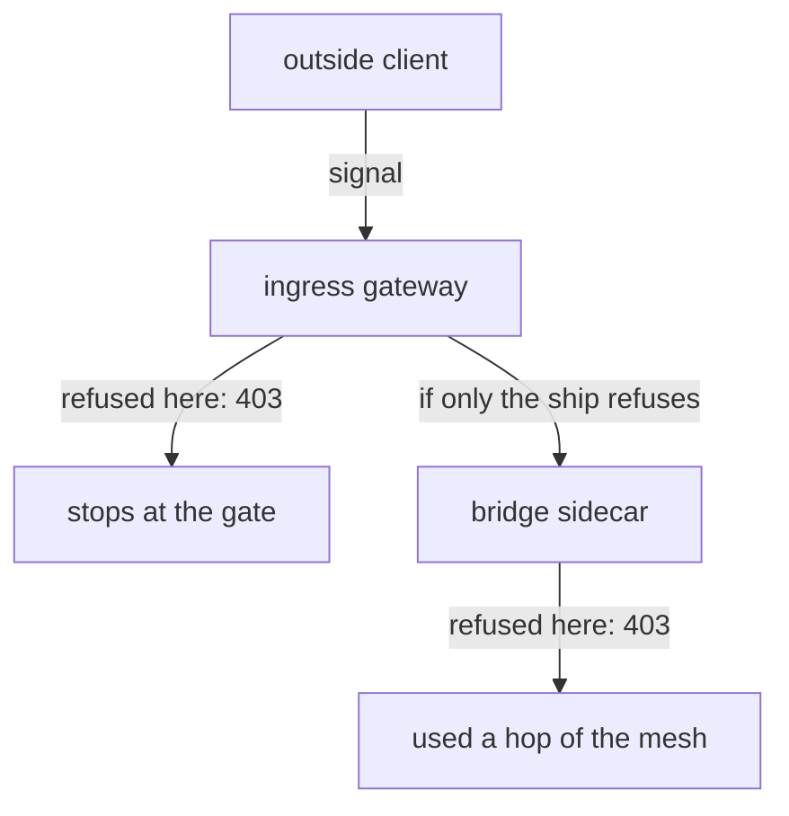

# Guard The Arrival Gate

Astronaut, an `AuthorizationPolicy` on the ingress gateway is the same object you already know, doing the same job one stop earlier. Nothing in its shape is new. What is new is **where** it has to live and **which pod** it has to select. Get those two wrong and the policy is accepted, shows up in `kubectl get`, and guards nothing.

This part shows the right place, the wrong place, and what you gain when the gate refuses a signal instead of the ship.

## The gate is a pod like any other

The ingress gateway is the spaceport arrival gate: the one door that signals from outside the solar system come through. Under the hood it is an Envoy proxy, the same program as the communications officer on every ship, running alone in its own pod. A policy guards it the way it guards any pod: by selecting the pod's labels.

<!-- astrona:playground:renew -->

### Look at the gate's labels

List the gateway pod with its `istio` label:

```sh
kubectl get pods -n istio-ingress -L istio
```

```text
NAME                             READY   STATUS    RESTARTS   AGE   ISTIO
istio-ingress-5f768fb4b6-sw8j5   1/1     Running   0          94s   ingress
```

The pod runs on the planet `istio-ingress` and carries `istio=ingress`. Those are the two values a gateway policy needs: its namespace, and its selector.

The label depends on how Istio was installed. The Helm `gateway` chart, installed as `istio-ingress` like here, sets `istio: ingress`. An `istioctl install` with the `demo` or `default` profile puts its gateway in `istio-system` with `istio: ingressgateway`. Always look before you write.

### Send a signal through the gate

The gate already routes `starfleet.example.com` to the `bridge`. Send one signal to its page and one to its API:

```sh
gate_status /productpage
gate_status /api/v1/products
```

```text
200
200
```

Both answer `200`. No policy guards the gate yet.

## Put the guard at the wrong post first

The most common gateway mistake is to put the policy next to the app it protects. See it once on purpose, so you recognise it later.

### A policy on the app's planet

This policy says "refuse every signal to the bridge's API". It selects `istio: ingress`, the right label, but it lives on the planet `starfleet`. Save this as `authorizationpolicy-gateway-deny-api-starfleet.yaml`:

```yaml
apiVersion: security.istio.io/v1
kind: AuthorizationPolicy
metadata:
  name: gateway-deny-api
  namespace: starfleet
spec:
  selector:
    matchLabels:
      istio: ingress
  action: DENY
  rules:
  - to:
    - operation:
        hosts: ["starfleet.example.com"]
        paths: ["/api/v1/products*"]
```

Apply it:

```sh
kubectl apply -f authorizationpolicy-gateway-deny-api-starfleet.yaml
```

```text
Warning: configured AuthorizationPolicy will deny all traffic to TCP ports under its scope due to the use of only HTTP attributes in a DENY rule; it is recommended to explicitly specify the port
authorizationpolicy.security.istio.io/gateway-deny-api created
```

The warning comes from `istiod`'s check of the policy, and it is normal here. A `DENY` rule that only names HTTP things (a host, a path) cannot be read on a plain TCP channel, so on such a channel Istio refuses everything instead. The gate only speaks HTTP on port `80`, so nothing extra is blocked. You will see this warning for every `DENY` with only HTTP fields in this module.

Wait about a minute, so the gate gets its new orders. Then check the result:

```sh
gate_status /api/v1/products
```

```text
200
```

Still `200`. Kubernetes accepted the policy and `istiod` (mission control) read it. But a `selector` only looks at pods **in the policy's own namespace**. No pod on the planet `starfleet` carries `istio=ingress`, so mission control sends these orders to nobody.

`paths: ["/api/v1/products*"]` matches the path and anything that starts with it. A `*` works only at the start or the end of a path. In the middle (`/api/*/products`) it is accepted, but read as a plain character, so the rule only matches that exact text.

## Put the guard at the right post

Now move the same orders to the gateway's own planet. Only the namespace changes.

### The policy on the gateway's planet

Save this as `authorizationpolicy-gateway-deny-api.yaml`:

```yaml
apiVersion: security.istio.io/v1
kind: AuthorizationPolicy
metadata:
  name: gateway-deny-api
  namespace: istio-ingress
spec:
  selector:
    matchLabels:
      istio: ingress
  action: DENY
  rules:
  - to:
    - operation:
        hosts: ["starfleet.example.com"]
        paths: ["/api/v1/products*"]
```

Apply it:

```sh
kubectl apply -f authorizationpolicy-gateway-deny-api.yaml
```

The same TCP warning appears, followed by `authorizationpolicy.security.istio.io/gateway-deny-api created`. Wait about a minute: signals on a connection that is already open keep the old orders for a short while. Then check the result, and read the gate's flight log:

```sh
gate_status /api/v1/products
gate_status /productpage
gate_log 2
```

```text
403
200
[2026-10-09T11:04:06.878Z] "GET /api/v1/products HTTP/1.1" 403 - rbac_access_denied_matched_policy[ns[istio-ingress]-policy[gateway-deny-api]-rule[0]] - "-" 0 19 1 - "10.244.0.6" "curl/8.7.1" "e5916760-04c7-42b8-9d1e-3b0d6d8d6707" "starfleet.example.com" "-" outbound|9080||bridge.starfleet.svc.cluster.local - 127.0.0.1:80 127.0.0.1:48930 - -
[2026-10-09T11:04:06.891Z] "GET /productpage HTTP/1.1" 200 - via_upstream - "-" 0 9423 75 75 "10.244.0.6" "curl/8.7.1" "672b0f64-8beb-48b1-876a-9cb8313378fb" "starfleet.example.com" "10.244.0.12:9080" outbound|9080||bridge.starfleet.svc.cluster.local 10.244.0.6:34832 127.0.0.1:80 127.0.0.1:48934 - -
```

The flight log is written in small batches. If `gate_log` does not show your signals yet, wait a few seconds and run it again.

The API now answers `403`, and the page still answers `200`. The gateway's Envoy did the refusing: its flight log names the policy that matched, in `rbac_access_denied_matched_policy[...]`. Note the shape of the failure. It is an ordinary `403` with a short body, not a dropped connection. The gate accepted the connection, read the request, and then refused it.

## What refusing at the gate saves

The same rule could guard the `bridge` ship instead. Both ways the sender gets `403`. The difference is how far the refused signal travels first.



When the gateway refuses, the signal never enters the mesh. When only the `bridge` sidecar refuses, the signal was routed, carried across the mesh with a secret handshake (mutual TLS), and only then turned away.

### Prove the signal never reached the bridge

Read the bridge's flight log, then send a signal to the same API from **inside** the mesh, from the `shuttle`, straight to the `bridge` Service:

```sh
kubectl logs -n starfleet deploy/bridge-v1 -c istio-proxy --tail=3 | grep products
kubectl exec -n starfleet deploy/shuttle -- curl -s -o /dev/null -w "%{http_code}\n" http://bridge:9080/api/v1/products
```

```text
200
```

The first command prints nothing: no line in the bridge's flight log mentions `/api/v1/products`. The `200` comes from the second command.

The refused signal from the gate is not in the bridge's log: it never arrived. But the shuttle still gets `200`. The guard stands at the gate, and a ship already inside the solar system never passes the gate. So guard the edge **and** the ships when it matters.

### The gate is shared

One gateway pod usually serves many hosts and many teams. A policy that selects `istio: ingress` guards **every** host on that pod, not only yours. That is why the policy above names `hosts: ["starfleet.example.com"]` as well as the path. Without it, a team that serves another host with an `/api/v1/products` path would be blocked too.

### Clean up

Remove both policies before you go on:

```sh
kubectl delete -f authorizationpolicy-gateway-deny-api.yaml
kubectl delete -f authorizationpolicy-gateway-deny-api-starfleet.yaml
```

## Common pitfalls

> [!WARNING]
> - **The policy on the app's planet.** A gateway policy must live in the namespace where the gateway pod runs (`istio-ingress` here). Anywhere else it is accepted and guards nothing.
> - **A selector copied from another install.** `istio: ingressgateway` belongs to an `istioctl` install. On a Helm install the label is `istio: ingress`. Check with `kubectl get pods -n istio-ingress -L istio`.
> - **Guarding only the gate.** Ships inside the mesh never pass the gate. A signal from the `shuttle` to the `bridge` ignores every gateway policy.
> - **Forgetting the gate is shared.** Without `hosts`, a rule on the gateway applies to every host it serves.
> - **Expecting a dropped connection.** A refusal at the gate is a normal `403`, written in the gate's flight log with the policy's name.

> *A gateway policy is an ordinary `AuthorizationPolicy` that lives on the gateway's planet and selects the gateway pod's labels.*
