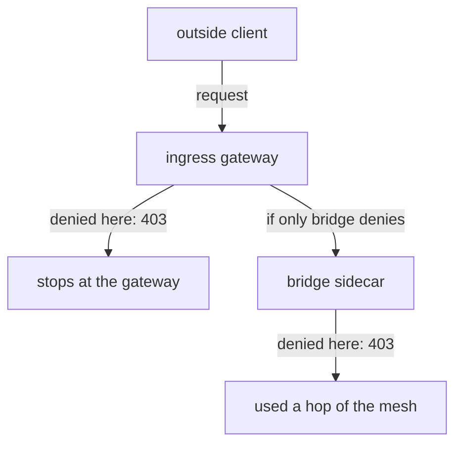

# Apply An AuthorizationPolicy To The Ingress Gateway

Requests from outside the cluster all come in through one door: the ingress gateway. If you can stop a bad request there, it never touches the rest of the mesh. Istio lets you do that with an `AuthorizationPolicy`, the same object that allows or denies requests to any workload. Nothing in its shape is new when you put it on the gateway.

What is new is **where** the policy has to live and **which pod** it has to select. Get those two wrong and the policy is accepted, shows up in `kubectl get`, and applies to nothing. This chapter shows the right place and the wrong place. It also shows what you gain when the gateway denies a request instead of the application pod.

## The gateway is a pod like any other

Under the hood, the ingress gateway is an Envoy proxy. It is the same program as the sidecar proxy in every application pod, but it runs alone in its own pod. A policy applies to it the way it applies to any pod: by selecting the pod's labels. So the first step is to look at those labels.

<!-- astrona:playground:renew -->

List the gateway pod with its `istio` label:

```sh
kubectl get pods -n istio-ingress -L istio
```

```text
NAME                             READY   STATUS    RESTARTS   AGE   ISTIO
istio-ingress-5f768fb4b6-sw8j5   1/1     Running   0          94s   ingress
```

The pod runs in the namespace `istio-ingress` and carries `istio=ingress`. Those are the two values a gateway policy needs: its namespace, and its selector.

The label depends on how Istio was installed. The Helm `gateway` chart, installed as `istio-ingress` like here, sets `istio: ingress`. An `istioctl install` with the `demo` or `default` profile puts its gateway in `istio-system` with `istio: ingressgateway`. So always look before you write.

Before you add any policy, make sure the gateway already routes `starfleet.example.com` to `bridge`. Send one request to its page and one to its API:

```sh
gate_status /productpage
gate_status /api/v1/products
```

```text
200
200
```

Both answer `200`, because no policy applies to the gateway yet. That is the baseline every later test is compared with.

## A policy in the wrong namespace

The most common gateway mistake is to put the policy next to the app it protects. It is worth making that mistake once on purpose, so you recognise it later.

The policy below says "deny every request to the `bridge` API". It selects `istio: ingress`, which is the right label, but it lives in the namespace `starfleet`. Save this as `authorizationpolicy-gateway-deny-api-starfleet.yaml`:

```yaml
apiVersion: security.istio.io/v1
kind: AuthorizationPolicy
metadata:
  name: gateway-deny-api
  namespace: starfleet
spec:
  selector:
    matchLabels:
      istio: ingress
  action: DENY
  rules:
  - to:
    - operation:
        hosts: ["starfleet.example.com"]
        paths: ["/api/v1/products*"]
```

Apply it:

```sh
kubectl apply -f authorizationpolicy-gateway-deny-api-starfleet.yaml
```

```text
Warning: configured AuthorizationPolicy will deny all traffic to TCP ports under its scope due to the use of only HTTP attributes in a DENY rule; it is recommended to explicitly specify the port
authorizationpolicy.security.istio.io/gateway-deny-api created
```

The warning comes from `istiod`, Istio's control plane, which checks each policy and sends configuration to every proxy. The warning is normal here. A `DENY` rule that only names HTTP fields, such as a host or a path, cannot be checked on a plain TCP port. So on such a port Istio denies everything instead. The gateway only serves HTTP on port `80`, so nothing extra is blocked, and you will see this warning for every `DENY` with only HTTP fields in this module.

The `paths` value `"/api/v1/products*"` matches the path and anything that starts with it. A `*` works only at the start or the end of a path. In the middle (`/api/*/products`) it is accepted, but read as a plain character, so the rule only matches that exact text.

Wait about a minute, so the gateway gets its new configuration. Then check the result:

```sh
gate_status /api/v1/products
```

```text
200
```

The API still answers `200`. Kubernetes accepted the policy and `istiod` read it. But a `selector` only looks at pods **in the policy's own namespace**. No pod in the namespace `starfleet` carries `istio=ingress`, so `istiod` sends this policy to no proxy at all.

## The same policy in the gateway's namespace

The fix is to move the policy to the gateway's own namespace. Only the namespace changes; every other line stays the same. Save this as `authorizationpolicy-gateway-deny-api.yaml`:

```yaml
apiVersion: security.istio.io/v1
kind: AuthorizationPolicy
metadata:
  name: gateway-deny-api
  namespace: istio-ingress
spec:
  selector:
    matchLabels:
      istio: ingress
  action: DENY
  rules:
  - to:
    - operation:
        hosts: ["starfleet.example.com"]
        paths: ["/api/v1/products*"]
```

Apply it:

```sh
kubectl apply -f authorizationpolicy-gateway-deny-api.yaml
```

The same TCP warning appears, followed by `authorizationpolicy.security.istio.io/gateway-deny-api created`. Wait about a minute again: requests on a connection that is already open keep the old configuration for a short while. Then send the two requests once more, and read the gateway's access log:

```sh
gate_status /api/v1/products
gate_status /productpage
gate_log 2
```

```text
403
200
[2026-10-09T11:04:06.878Z] "GET /api/v1/products HTTP/1.1" 403 - rbac_access_denied_matched_policy[ns[istio-ingress]-policy[gateway-deny-api]-rule[0]] - "-" 0 19 1 - "10.244.0.6" "curl/8.7.1" "e5916760-04c7-42b8-9d1e-3b0d6d8d6707" "starfleet.example.com" "-" outbound|9080||bridge.starfleet.svc.cluster.local - 127.0.0.1:80 127.0.0.1:48930 - -
[2026-10-09T11:04:06.891Z] "GET /productpage HTTP/1.1" 200 - via_upstream - "-" 0 9423 75 75 "10.244.0.6" "curl/8.7.1" "672b0f64-8beb-48b1-876a-9cb8313378fb" "starfleet.example.com" "10.244.0.12:9080" outbound|9080||bridge.starfleet.svc.cluster.local 10.244.0.6:34832 127.0.0.1:80 127.0.0.1:48934 - -
```

Envoy writes the access log in small batches. If `gate_log` does not show your requests yet, wait a few seconds and run it again.

The API now answers `403`, and the page still answers `200`. The gateway's Envoy did the denying: its access log names the matching policy in `rbac_access_denied_matched_policy[...]`. Note the shape of the failure, too. It is an ordinary `403` with a short body, not a dropped connection. The gateway accepted the connection, read the request, and only then denied it.

## What denying at the gateway saves

The same rule could apply to the `bridge` pod instead, and the client would get `403` either way. The difference is how far the denied request travels first.



The diagram shows the two paths. When the gateway denies, the request never enters the mesh. When only the `bridge` sidecar denies, the request was routed and carried across the mesh over mutual TLS (mTLS: both sides present a certificate) before it was denied.

You can prove that the denied request never reached `bridge`. First read the access log of the `bridge` sidecar. Then send a request to the same API from **inside** the mesh, from the `shuttle` pod, straight to the `bridge` Service:

```sh
kubectl logs -n starfleet deploy/bridge-v1 -c istio-proxy --tail=3 | grep products
kubectl exec -n starfleet deploy/shuttle -- curl -s -o /dev/null -w "%{http_code}\n" http://bridge:9080/api/v1/products
```

```text
200
```

The first command prints nothing: no line in the `bridge` access log mentions `/api/v1/products`. The `200` comes from the second command.

So the request that the gateway denied never arrived at `bridge`. Yet `shuttle` still gets `200`, because the policy applies only to the gateway, and a pod already inside the mesh never passes through it. When the workload itself matters, protect the edge **and** the workload.

There is one more reason to write gateway rules with care: the gateway is shared. One gateway pod usually serves many hosts and many teams. A policy that selects `istio: ingress` applies to **every** host on that pod, not only yours. That is why the policy above names `hosts: ["starfleet.example.com"]` as well as the path. Without it, a team that serves another host with an `/api/v1/products` path would be blocked too.

Remove both policies before you go on:

```sh
kubectl delete -f authorizationpolicy-gateway-deny-api.yaml
kubectl delete -f authorizationpolicy-gateway-deny-api-starfleet.yaml
```

You now know that a gateway policy is an ordinary `AuthorizationPolicy` that lives in the gateway's namespace and selects the gateway pod's labels. A denial there is a plain `403`, written in the gateway's access log, and the request never enters the mesh. This rule matched on a host and a path. The question still open is how to match on where the request came from, and that turns out to be harder than it looks.

## Common pitfalls

> [!WARNING]
> - **The policy in the app's namespace.** A gateway policy must live in the namespace where the gateway pod runs (`istio-ingress` here). Anywhere else it is accepted and applies to nothing.
> - **A selector copied from another install.** `istio: ingressgateway` belongs to an `istioctl` install. On a Helm install the label is `istio: ingress`. Check with `kubectl get pods -n istio-ingress -L istio`.
> - **Protecting only the gateway.** Pods inside the mesh never pass through the gateway. A request from `shuttle` to `bridge` ignores every gateway policy.
> - **Forgetting the gateway is shared.** Without `hosts`, a rule on the gateway applies to every host it serves.
> - **Expecting a dropped connection.** A denial at the gateway is a normal `403`, written in the gateway's access log with the policy's name.
