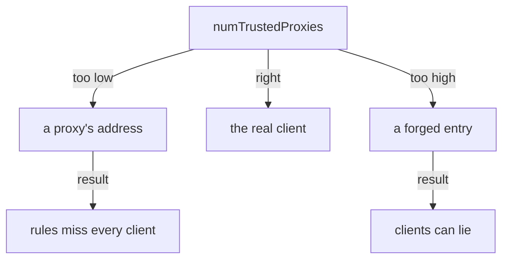

# Set `numTrustedProxies` For `X-Forwarded-For`

Behind a proxy, the connection never tells you who the real client is. The proxy does tell you, though: it writes the client's address into a request header called `X-Forwarded-For`. The problem is that a client can write into that header too. If the gateway believes the wrong entry, an attacker can pick any address they like.

This chapter shows how the header grows as a request passes proxies, and how the gateway decides which entry to believe. You control that decision with one number, `numTrustedProxies`. You will set it, prove that the gateway really uses it, and see what happens when it is wrong.

## How `X-Forwarded-For` grows

`X-Forwarded-For` (often shortened to XFF in logs and documentation) is a list of addresses in one request header. Every proxy that forwards the request adds one entry to the end of the list. The entry a proxy adds is the address it **received** the request from:

```text
   real client       CDN               load balancer        gateway
   198.51.100.7 ──▶  203.0.113.9  ──▶  192.0.2.50     ──▶   receives:
                                                            XFF:  198.51.100.7, 203.0.113.9
                                                            peer: 192.0.2.50
```

The CDN received the request from the client, so it adds `198.51.100.7`. The load balancer received it from the CDN, so it adds `203.0.113.9`. The last proxy's own address is not in the list. It is the connection peer, the address that `ipBlocks` matches. So the list reads from left to right, from the furthest hop to the nearest.

Proxies **add** to the list; they do not replace it. That one fact is the root of the security problem. A client can send its own `X-Forwarded-For` with any address it likes, and that lie stays at the front of the list:

```text
   attacker sends:        X-Forwarded-For: 10.1.2.3         (a lie)
   load balancer adds:    X-Forwarded-For: 10.1.2.3, 198.51.100.7
                                           └ forged   └ the real client
```

A gateway that believes the **first** entry believes the attacker. Only the entries that your own proxies wrote can be trusted, and those are always at the **end** of the list.

## `numTrustedProxies` says how many entries to trust

Since only the end of the list is trustworthy, the gateway needs to know where your proxies' entries stop. You tell it how many proxies you run in front of it, and that number is `numTrustedProxies`. The gateway then counts that many entries from the **right** end of the list, and treats the address it lands on as the client:

```text
   XFF at the gateway:         10.1.2.3 , 198.51.100.7 , 203.0.113.9
                                              ▲               ▲
   numTrustedProxies: 2  ─────────────────────┘               │
   numTrustedProxies: 1  ─────────────────────────────────────┘
```

This is the CDN and load balancer setup from above, with a forged entry in front. Two proxies run, so `2` lands on the real client, `198.51.100.7`. A value of `1` would land on the CDN's address instead.

With one load balancer, the right number is `1`. With a CDN and a load balancer, it is `2`. The number is a fact about how your network is built, not a value to tune. If someone adds a CDN in front later, the number must change too, and nothing in the cluster reminds you.

The client address the gateway lands on is what `remoteIpBlocks` matches. Envoy, the proxy inside the gateway pod, calls the same setting `xffNumTrustedHops`. Both directions of mistake are real, and they fail in different ways:

- **Too low, or not set.** The gateway lands on an entry that one of your own proxies added. With `0`, it ignores the header and uses the connection peer. Either way `remoteIpBlocks` sees a proxy, just like `ipBlocks`, and rules for real clients match nobody, or everybody.
- **Too high.** The gateway counts past your proxies and lands on an entry the client wrote. A client sends a forged address and the gateway believes it. This is a security hole, not just an outage.



The diagram sums it up: the number must match the proxies you really run. One less and you see a proxy; one more and you trust a client's lie.

## Set the number and prove the gateway uses it

`numTrustedProxies` is not a field of any policy. It is part of the proxy's own startup settings, its proxy configuration, so you set it where Istio is installed. The gateway reads it when it starts. Before you change anything, see how the gateway behaves without it.

<!-- astrona:playground:renew -->

Send a request that claims to come from `10.1.2.3`, read the gateway's access log, and ask the gateway whether it trusts any proxy:

```sh
gate_status /productpage 10.1.2.3
gate_log
istioctl proxy-config listener deploy/istio-ingress -n istio-ingress -o json | grep xffNumTrustedHops
```

```text
200
[2026-10-09T11:08:20.066Z] "GET /productpage HTTP/1.1" 200 - via_upstream - "-" 0 9423 25 25 "10.1.2.3,10.244.0.6" "curl/8.7.1" "e5da2c8c-ccdb-4763-b218-ffa156380368" "starfleet.example.com" "10.244.0.12:9080" outbound|9080||bridge.starfleet.svc.cluster.local 10.244.0.6:34832 127.0.0.1:80 127.0.0.1:58194 - -
```

The `grep` prints nothing.

The header did reach the gateway: you can see it in the log line's `X-Forwarded-For` field, `"10.1.2.3,10.244.0.6"`. The gateway added its own pod address, `10.244.0.6`, to the end before it forwarded the request. But the client address at the end of the line is still `127.0.0.1`, the tunnel. And the gateway's listener has no `xffNumTrustedHops` at all. With no trusted proxies, the gateway ignores the header when it decides who the client is.

In this playground, Istio was installed with Helm, and `istiod` holds the mesh-wide settings. The value to set is `meshConfig.defaultConfig.gatewayTopology.numTrustedProxies`: the default proxy configuration for every gateway. Save this as `values-istiod-topology.yaml`:

```yaml
meshConfig:
  defaultConfig:
    gatewayTopology:
      numTrustedProxies: 1
```

Apply it to the `istiod` release. The flag `--reuse-values` keeps everything else as it was installed:

```sh
helm upgrade istiod istiod --repo https://istio-release.storage.googleapis.com/charts \
  --version 1.30.5 -n istio-system --reuse-values -f values-istiod-topology.yaml
```

```text
Release "istiod" has been upgraded. Happy Helming!
NAME: istiod
LAST DEPLOYED: Fri Oct  9 13:08:26 2026
NAMESPACE: istio-system
STATUS: deployed
REVISION: 2
DESCRIPTION: Upgrade complete
```

The output goes on with the chart's notes; we cut them here. `REVISION: 2` means Helm changed the installed release. `istiod` now holds the new default, but the running gateway does not have it yet, because the gateway only reads its proxy configuration when it starts. Restart it:

```sh
kubectl rollout restart deployment/istio-ingress -n istio-ingress
kubectl rollout status deployment/istio-ingress -n istio-ingress
```

```text
deployment.apps/istio-ingress restarted
Waiting for deployment spec update to be observed...
Waiting for deployment "istio-ingress" rollout to finish: 0 out of 1 new replicas have been updated...
Waiting for deployment "istio-ingress" rollout to finish: 1 old replicas are pending termination...
deployment "istio-ingress" successfully rolled out
```

The restart moves the gateway to a new pod, so the port forward drops for a moment, and `astrona` opens it again by itself. For a short while `gate_status` can print `000` or `404` while the tunnel still points at the old pod. Wait about thirty seconds and try again.

A setting in a file is not proof. The proof is in the gateway's own listener, the place where Envoy really holds the value. Ask for it:

```sh
istioctl proxy-config listener deploy/istio-ingress -n istio-ingress -o json | grep xffNumTrustedHops
```

```text
                            "xffNumTrustedHops": 1,
```

`xffNumTrustedHops: 1` is there, once for each HTTP listener the gateway has open. Right now that is only port `80`. Now send the same request as before:

```sh
gate_status /productpage 10.1.2.3
gate_log
```

```text
200
[2026-10-09T11:19:32.336Z] "GET /productpage HTTP/1.1" 200 - via_upstream - "-" 0 15064 62 61 "10.1.2.3,10.244.0.18" "curl/8.7.1" "c5950d0e-5d96-42c5-9189-361b721296ed" "starfleet.example.com" "10.244.0.12:9080" outbound|9080||bridge.starfleet.svc.cluster.local 10.244.0.18:60878 127.0.0.1:80 10.1.2.3:0 - -
```

The client address at the end of the log line is now `10.1.2.3:0`. The gateway knows no port for an address it read from a header, so it prints `0`. The new gateway pod has a new address, `10.244.0.18`, which it adds to the header as before. The gateway took the client from the header, one entry from the right. In this playground your `curl` command acts as the trusted proxy: it writes the entry that the gateway believes.

The real test is a list with two entries, as a client would send if it forged the first one:

```sh
gate_status /productpage "192.168.5.5, 10.1.2.3"
gate_log
```

```text
200
[2026-10-09T11:19:36.475Z] "GET /productpage HTTP/1.1" 200 - via_upstream - "-" 0 9423 27 27 "192.168.5.5, 10.1.2.3,10.244.0.18" "curl/8.7.1" "d8b5912d-1efd-48ff-99c7-df74575d3aa1" "starfleet.example.com" "10.244.0.12:9080" outbound|9080||bridge.starfleet.svc.cluster.local 10.244.0.18:60878 127.0.0.1:80 10.1.2.3:0 - -
```

The gateway chose `10.1.2.3`, the last entry, and ignored `192.168.5.5` in front of it. With `numTrustedProxies: 2`, it would count one step further and believe `192.168.5.5`. We tried it on this playground: the same request then ends its log line with `192.168.5.5:0`. That is the "too high" mistake: one proxy, two trusted entries, and the client's forged entry wins.

## Other places to set the same number

The Helm value above sets the default for every gateway in the mesh. You can also set the number in two other ways: with `istioctl`, or for one gateway only.

```yaml
# With istioctl: the same mesh-wide default, in an IstioOperator file
spec:
  meshConfig:
    defaultConfig:
      gatewayTopology:
        numTrustedProxies: 1
```

```yaml
# For one gateway only: an annotation on the gateway's pod template.
# It wins over the mesh-wide default.
metadata:
  annotations:
    proxy.istio.io/config: |
      gatewayTopology:
        numTrustedProxies: 1
```

With the Helm `gateway` chart, the annotation goes into the chart value `podAnnotations`. A `helm upgrade` of the gateway with a new annotation changes the pod template, so Kubernetes starts a new gateway pod by itself. The two mesh-wide ways need a `kubectl rollout restart` of the gateway before they work.

Watch out for one trap here. A key placed directly under `meshConfig.gatewayTopology`, without `defaultConfig`, is not a real setting. `istioctl` accepts it without an error and the gateway ignores it.

> [!TIP]
> Never trust a proxy setting because the install command succeeded. Read it back from the running proxy with `istioctl proxy-config listener ... -o json` and look for the value Envoy really holds, here `xffNumTrustedHops`.

You now know that `numTrustedProxies` tells the gateway how many entries at the end of `X-Forwarded-For` come from your own proxies, and the entry just before them is the client. You set it with Helm, restarted the gateway and proved it in the listener. What you have not done yet is write a rule on that client address. That is the job of `remoteIpBlocks`.

## Common pitfalls

> [!WARNING]
> - **Believing the first entry of `X-Forwarded-For`.** A client writes it. Only the entries your own proxies add, at the end of the list, can be trusted.
> - **A number that does not match your proxies.** Too low and the gateway sees a proxy; too high and a client can fake its address.
> - **Setting it and not restarting the gateway.** The gateway reads its proxy configuration when it starts. Run `kubectl rollout restart` on it.
> - **The wrong key.** `meshConfig.gatewayTopology.numTrustedProxies` is accepted and ignored. The real key is under `meshConfig.defaultConfig.gatewayTopology`, or in the gateway's `proxy.istio.io/config` annotation.
> - **Checking the file instead of the gateway.** Prove it with `istioctl proxy-config listener ... -o json | grep xffNumTrustedHops`.
