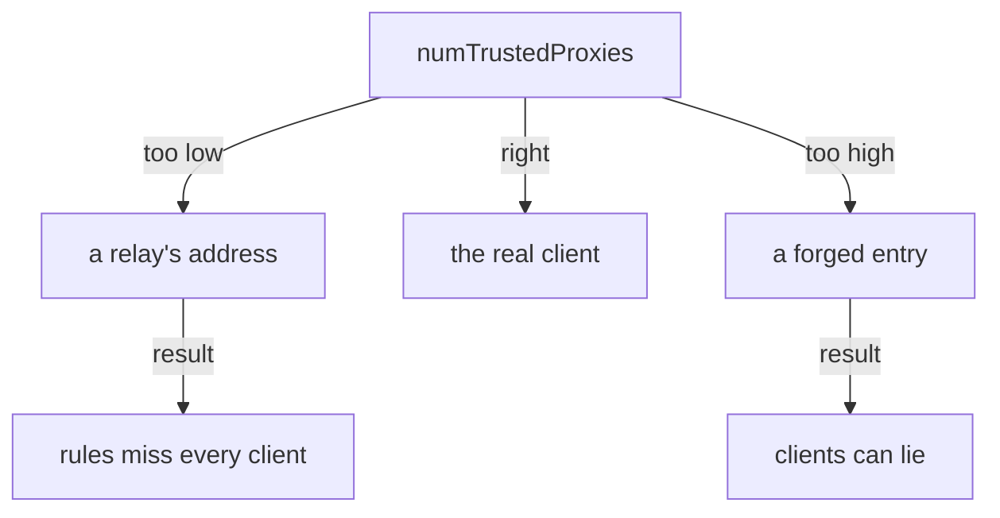

# Trust The Right Number Of Relays

Astronaut, behind a relay the connection never tells you who the real client is. The relay does tell you, though: it writes the client's address into a header called `X-Forwarded-For`. The problem is that a client can write into that header too. This part shows how the header grows, how the gateway decides which entry to believe, and how you set that with one number: `numTrustedProxies`.

## How `X-Forwarded-For` grows

`X-Forwarded-For` (often shortened to XFF in logs and docs) is a list of addresses in a request header. Picture it as the signal's travel log: every relay station that passes the signal on adds one stamp to the end of the list.

### Each relay adds one stamp

The stamp a relay adds is the address it **received** the signal from:

```text
   real client       CDN               load balancer        gateway
   198.51.100.7 ──▶  203.0.113.9  ──▶  192.0.2.50     ──▶   receives:
                                                            XFF:  198.51.100.7, 203.0.113.9
                                                            peer: 192.0.2.50
```

The CDN received the signal from the client, so it stamps `198.51.100.7`. The load balancer received it from the CDN, so it stamps `203.0.113.9`. The last relay's own address is not in the list: it is the connection peer, the address that `ipBlocks` matches. So the list reads from left to right, from the furthest hop to the nearest.

### Anyone can write the first stamps

Relays **add** to the list. They do not replace it. So a client can send its own `X-Forwarded-For` with any address it likes, and that lie stays at the front of the list:

```text
   attacker sends:        X-Forwarded-For: 10.1.2.3         (a lie)
   load balancer adds:    X-Forwarded-For: 10.1.2.3, 198.51.100.7
                                           └ forged   └ the real client
```

A gateway that believes the **first** entry believes the attacker. Only the entries that your own relays wrote can be trusted, and those are always at the **end** of the list.

## `numTrustedProxies` says how many stamps to trust

You tell the gateway how many relays you run in front of it. That number is `numTrustedProxies`. The gateway then counts that many entries from the **right** end of the list, and treats the address it lands on as the client.

### Count from the right

```text
   XFF arriving at the gate:   10.1.2.3 , 198.51.100.7 , 203.0.113.9
                                              ▲               ▲
   numTrustedProxies: 2  ─────────────────────┘               │
   numTrustedProxies: 1  ─────────────────────────────────────┘
```

This is the CDN and load balancer setup from above, with a forged entry in front. Two relays, so `2` lands on the real client, `198.51.100.7`. `1` would land on the CDN's address.

With one load balancer, the right number is `1`. With a CDN and a load balancer, it is `2`. The number is a fact about how your network is built, not a value to tune. If someone adds a CDN in front later, the number must change too, and nothing in the cluster reminds you.

The client address the gateway lands on is what `remoteIpBlocks` matches. Envoy, the program inside the gateway, calls the same setting `xffNumTrustedHops`.

### Too low and too high

Both mistakes are real, and they fail in different ways:

- **Too low, or not set.** The gateway lands on a stamp that one of your own relays made, or, with `0`, ignores the header and uses the connection peer. `remoteIpBlocks` then sees a relay, just like `ipBlocks`. Rules for real clients match nobody, or everybody.
- **Too high.** The gateway counts past your relays and lands on an entry the client wrote. The rule is now easy to fool: a client sends a forged address and the gate believes it. This is a security hole, not just an outage.



The number must match the relays you really run: one less and you see a relay, one more and you trust a client's lie.

## Set it, and prove the gateway uses it

`numTrustedProxies` is not a field of any policy. It is part of the proxy's own startup settings (its proxy configuration), so it is set where Istio is installed. The gateway reads it when it starts.

<!-- astrona:playground:renew -->

### Before: the gate ignores the header

Send a signal that claims to come from `10.1.2.3`, read the gate's flight log, and ask the gateway whether it trusts any relay:

```sh
gate_status /productpage 10.1.2.3
gate_log
istioctl proxy-config listener deploy/istio-ingress -n istio-ingress -o json | grep xffNumTrustedHops
```

```text
200
[2026-10-09T11:08:20.066Z] "GET /productpage HTTP/1.1" 200 - via_upstream - "-" 0 9423 25 25 "10.1.2.3,10.244.0.6" "curl/8.7.1" "e5da2c8c-ccdb-4763-b218-ffa156380368" "starfleet.example.com" "10.244.0.12:9080" outbound|9080||bridge.starfleet.svc.cluster.local 10.244.0.6:34832 127.0.0.1:80 127.0.0.1:58194 - -
```

The `grep` prints nothing.

The header reached the gate: you can see it in the log line's `X-Forwarded-For` field, `"10.1.2.3,10.244.0.6"`. The gate added its own pod address, `10.244.0.6`, to the end before it passed the signal on. But the client address at the end of the line is still `127.0.0.1`, the tunnel. And the gateway's listener has no `xffNumTrustedHops` at all. With no trusted relays, the gate ignores the header when it decides who the client is.

### Set one trusted relay with Helm

In this playground, Istio was installed with Helm, and `istiod` holds the mesh-wide settings. The value is `meshConfig.defaultConfig.gatewayTopology.numTrustedProxies`: the default proxy configuration for every gateway. Save this as `values-istiod-topology.yaml`:

```yaml
meshConfig:
  defaultConfig:
    gatewayTopology:
      numTrustedProxies: 1
```

Apply it to the `istiod` release. `--reuse-values` keeps everything else as it was installed:

```sh
helm upgrade istiod istiod --repo https://istio-release.storage.googleapis.com/charts \
  --version 1.30.5 -n istio-system --reuse-values -f values-istiod-topology.yaml
```

```text
Release "istiod" has been upgraded. Happy Helming!
NAME: istiod
LAST DEPLOYED: Fri Oct  9 13:08:26 2026
NAMESPACE: istio-system
STATUS: deployed
REVISION: 2
DESCRIPTION: Upgrade complete
```

The output goes on with the chart's notes; we cut them here. `REVISION: 2` means Helm changed the installed release. `istiod` now holds the new default, but the running gateway does not have it yet.

The gateway only reads its proxy configuration when it starts. Restart it:

```sh
kubectl rollout restart deployment/istio-ingress -n istio-ingress
kubectl rollout status deployment/istio-ingress -n istio-ingress
```

```text
deployment.apps/istio-ingress restarted
Waiting for deployment spec update to be observed...
Waiting for deployment "istio-ingress" rollout to finish: 0 out of 1 new replicas have been updated...
Waiting for deployment "istio-ingress" rollout to finish: 1 old replicas are pending termination...
deployment "istio-ingress" successfully rolled out
```

The restart moves the gateway to a new pod, so the port forward drops for a moment. `astrona` opens it again by itself. For a short while `gate_status` can print `000` or `404` while the tunnel still points at the old pod. Wait about thirty seconds and try again.

### Prove the gateway uses it

A setting in a file is not proof. Ask the gateway's own listener, the place where Envoy really holds it:

```sh
istioctl proxy-config listener deploy/istio-ingress -n istio-ingress -o json | grep xffNumTrustedHops
```

```text
                            "xffNumTrustedHops": 1,
```

`xffNumTrustedHops: 1` is there, once for each HTTP door (listener) the gate has open. Right now that is only port `80`. Now send the same signal again:

```sh
gate_status /productpage 10.1.2.3
gate_log
```

```text
200
[2026-10-09T11:19:32.336Z] "GET /productpage HTTP/1.1" 200 - via_upstream - "-" 0 15064 62 61 "10.1.2.3,10.244.0.18" "curl/8.7.1" "c5950d0e-5d96-42c5-9189-361b721296ed" "starfleet.example.com" "10.244.0.12:9080" outbound|9080||bridge.starfleet.svc.cluster.local 10.244.0.18:60878 127.0.0.1:80 10.1.2.3:0 - -
```

The client address at the end of the log line is now `10.1.2.3:0` (the gate knows no port for an address it read from a header, so it prints `0`). The new gateway pod has a new address, `10.244.0.18`, which it adds to the header as before. The gateway took it from the header, one stamp from the right. In this playground your `curl` command plays the trusted relay: it writes the stamp that the gate believes.

### Two stamps: which one wins

Now send a list with two entries, as a client would that forged the first one:

```sh
gate_status /productpage "192.168.5.5, 10.1.2.3"
gate_log
```

```text
200
[2026-10-09T11:19:36.475Z] "GET /productpage HTTP/1.1" 200 - via_upstream - "-" 0 9423 27 27 "192.168.5.5, 10.1.2.3,10.244.0.18" "curl/8.7.1" "d8b5912d-1efd-48ff-99c7-df74575d3aa1" "starfleet.example.com" "10.244.0.12:9080" outbound|9080||bridge.starfleet.svc.cluster.local 10.244.0.18:60878 127.0.0.1:80 10.1.2.3:0 - -
```

The gate chose `10.1.2.3`, the last entry, and ignored `192.168.5.5` in front of it. With `numTrustedProxies: 2`, it counts one step further and believes `192.168.5.5`. We tried it on this playground: the same signal then ends its log line with `192.168.5.5:0`. That is the "too high" mistake: one relay, two trusted stamps, and the client's forged entry wins.

## Other places to set the same number

The Helm value above sets the default for every gateway in the mesh. You can also set it in two other ways:

```yaml
# With istioctl: the same mesh-wide default, in an IstioOperator file
spec:
  meshConfig:
    defaultConfig:
      gatewayTopology:
        numTrustedProxies: 1
```

```yaml
# For one gateway only: an annotation on the gateway's pod template.
# It wins over the mesh-wide default.
metadata:
  annotations:
    proxy.istio.io/config: |
      gatewayTopology:
        numTrustedProxies: 1
```

With the Helm `gateway` chart, the annotation goes into the chart value `podAnnotations`. A `helm upgrade` of the gateway with a new annotation changes the pod template, so Kubernetes starts a new gateway pod by itself. The two mesh-wide ways need a `kubectl rollout restart` of the gateway before they work. A key placed directly under `meshConfig.gatewayTopology` (without `defaultConfig`) is not a real setting. `istioctl` accepts it without an error and the gateway ignores it, so always prove the result with `xffNumTrustedHops`.

## Common pitfalls

> [!WARNING]
> - **Believing the first entry of `X-Forwarded-For`.** A client writes it. Only the stamps your own relays add, at the end of the list, can be trusted.
> - **A number that does not match your relays.** Too low and the gate sees a relay; too high and a client can fake its address.
> - **Setting it and not restarting the gateway.** The gateway reads its proxy configuration when it starts. Run `kubectl rollout restart` on it.
> - **The wrong key.** `meshConfig.gatewayTopology.numTrustedProxies` is accepted and ignored. The real key is under `meshConfig.defaultConfig.gatewayTopology`, or in the gateway's `proxy.istio.io/config` annotation.
> - **Checking the file instead of the gateway.** Prove it with `istioctl proxy-config listener ... -o json | grep xffNumTrustedHops`.

> *`numTrustedProxies` tells the gate how many stamps at the end of `X-Forwarded-For` come from your own relays. The entry just before them is the client.*
