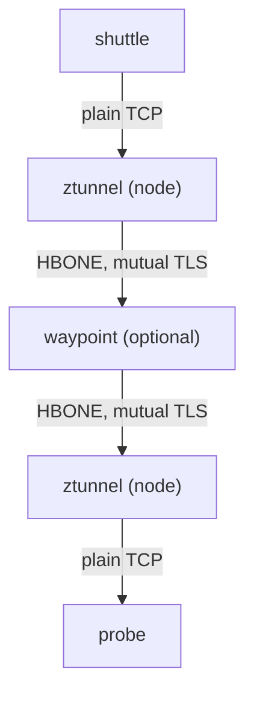
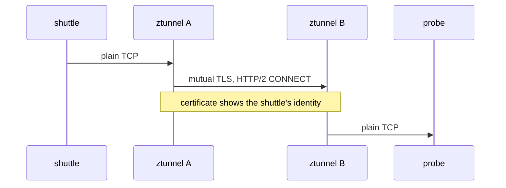
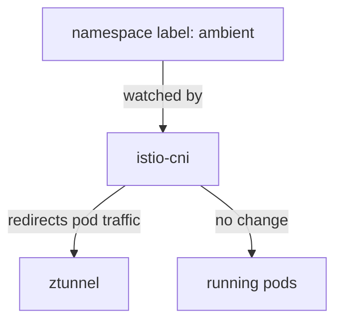

# The Ambient Dataplane

In sidecar mode, every pod has its own sidecar proxy (Envoy): a proxy container that Istio adds to the pod, so all of the pod's traffic passes through it. In ambient mode, pods run without one. That raises a question you must answer before you write a single policy: if no proxy sits in the pod, which component sees the traffic, and what can it see?

Every rule in this module follows from that answer. This chapter shows the new layout first: the two proxies that replace the sidecar, the tunnel they use, and the way a pod joins the mesh. Then you look at your own `starfleet` namespace and see each of these pieces at work.

## Two layers instead of one

In sidecar mode, one proxy in each pod did everything: mutual TLS (mTLS, where both sides show a certificate and both identities are checked), the connection handling, and reading HTTP for routing and policy. Every pod paid for all of it, even when it needed only a part. Ambient mode splits that work into two layers that you switch on separately.

The first layer is **ztunnel** (short for "zero-trust tunnel"). It runs once on every node, as a DaemonSet, and acts as a shared proxy for all the pods on that node. Every connection a pod opens or receives passes through it.

ztunnel does two jobs. It does the mutual TLS for every pod, so both sides prove who they are. And it enforces rules about the connection. It does **not** read HTTP. It sees connections, not requests: the addresses, ports and identities, never the HTTP request inside. The connection is **L4** (layer 4, the transport layer), and the HTTP request inside it is **L7** (layer 7, the application layer).

The second layer is the **waypoint**, a full Envoy proxy that runs as its own Deployment. When a Service uses a waypoint, every request to that Service passes through the waypoint first, and the waypoint reads the request: the method, the path, the headers. You only get a waypoint where you create one, for a whole namespace or for one service. It is created as a Gateway API `Gateway` object, which is why the playground has the Gateway API CRDs (Custom Resource Definitions, the extra object types Kubernetes learns about).



The diagram follows one request. It leaves the `shuttle` pod as plain traffic. The ztunnel on the `shuttle` pod's node wraps it in a secure tunnel and sends it on, through a waypoint only if the destination has one. The ztunnel on the receiving node unwraps it and hands it to the `probe`. Without a waypoint, the two ztunnels talk to each other directly.

The idea is that you pay for reading HTTP only where you need it. For security work, this adds one question you must ask before you write any policy: **is there a waypoint in this request's path?** Nothing in the policy object asks it for you.

## HBONE: the mTLS tunnel

The secure tunnel between the two ztunnels has a name, and it explains why identity still works without a sidecar. ztunnel does not send raw connections between nodes. It wraps each one in **HBONE** (HTTP-Based Overlay Network Environment). That is a tunnel built with the HTTP/2 `CONNECT` method, inside mutual TLS, on port `15008`, between two ztunnels (or a ztunnel and a waypoint).



The diagram shows where the identity travels. ztunnel A shows the `shuttle` workload's certificate on the tunnel. ztunnel B checks it, and so learns exactly who is calling before any byte reaches the probe.

Two facts follow from this, and the first one surprises people. Identity works exactly as in sidecar mode. The certificates are the same ones, issued for the same service accounts, so rules on `principals` and `namespaces` work at L4, with no waypoint. "HTTP rules need a waypoint" often gets stretched into "every useful rule needs a waypoint", and that is wrong.

The second fact is the limit. The tunnel uses HTTP/2, but ztunnel does not read your HTTP. HTTP/2 `CONNECT` is only the tunnel, and the traffic inside it is just bytes to ztunnel.

## How traffic reaches ztunnel without a sidecar

One piece is still missing: how a pod's traffic gets to ztunnel at all. A sidecar lived inside the pod, so rules inside the pod caught its traffic. Ambient mode has no sidecar, so the redirect has to be set up from outside the pod. That job belongs to **istio-cni**, a DaemonSet on every node: it redirects the traffic of each enrolled pod to the ztunnel on the same node.



The diagram shows that enrolment is a label, not an injection. You label a namespace `istio.io/dataplane-mode=ambient`. istio-cni notices the pods there and sends their traffic to the ztunnel on their node. The pods themselves are not touched: no new container, no change to the pod spec, no restart.

That is the big difference from sidecar injection. Injection rewrites the pod spec when a pod is created, so pods that are already running need a restart. Ambient enrolment changes the node's networking instead, so **labelling a namespace enrols the pods that are already running**, straight away. In this playground, the `starfleet` namespace was labelled when it was created.

## What enrolment looks like

"Enrolled" is not something you can see inside a pod, because there is no extra container to look for. What you can see is the label on the namespace, the pods with one container each, and what ztunnel knows about them. Start with the label.

<!-- astrona:playground:renew -->

Show the labels on the `starfleet` namespace:

```sh
kubectl get namespace starfleet --show-labels
```

```text
NAME        STATUS   AGE   LABELS
starfleet   Active   64s   istio.io/dataplane-mode=ambient,kubernetes.io/metadata.name=starfleet
```

The label `istio.io/dataplane-mode=ambient` is the whole enrolment. There is no `istio-injection` label.

If the label enrols the pods, the pods themselves should look exactly as Kubernetes started them. List them:

```sh
kubectl get pods -n starfleet
```

```text
NAME                         READY   STATUS    RESTARTS   AGE
bridge-v1-bc4dc4fcc-fzm64    1/1     Running   0          64s
cargo-v1-6f787f8bd5-h2bpn    1/1     Running   0          64s
navcom-v1-7467bbc689-jrmws   1/1     Running   0          64s
probe-v1-7888d6c6d5-n4ctm    1/1     Running   0          64s
probe-v2-58767cc46-wh5wl     1/1     Running   0          64s
scout-v1-85bf65868-jkgpc     1/1     Running   0          64s
scout-v2-866c98b568-89pcs    1/1     Running   0          64s
scout-v3-668c6dfc68-h9rcp    1/1     Running   0          64s
shuttle-7b5db664c-hmlqb      1/1     Running   0          64s
```

Every pod shows `1/1`. There is no `istio-proxy` container anywhere, and yet every pod is in the mesh.

The real proof of enrolment sits in ztunnel. `istioctl ztunnel-config workload` lists every workload that the ztunnels know about. Keep the header line and the `starfleet` lines:

```sh
istioctl ztunnel-config workload | grep -E "NAMESPACE|starfleet"
```

```text
NAMESPACE          POD NAME                                                              ADDRESS     NODE                                          WAYPOINT PROTOCOL
starfleet          bridge-v1-bc4dc4fcc-fzm64                                             10.244.0.12 astro-ats-015-playground-060-01-control-plane None     HBONE
starfleet          cargo-v1-6f787f8bd5-h2bpn                                             10.244.0.8  astro-ats-015-playground-060-01-control-plane None     HBONE
starfleet          navcom-v1-7467bbc689-jrmws                                            10.244.0.9  astro-ats-015-playground-060-01-control-plane None     HBONE
starfleet          probe-v1-7888d6c6d5-n4ctm                                             10.244.0.15 astro-ats-015-playground-060-01-control-plane None     HBONE
starfleet          probe-v2-58767cc46-wh5wl                                              10.244.0.16 astro-ats-015-playground-060-01-control-plane None     HBONE
starfleet          scout-v1-85bf65868-jkgpc                                              10.244.0.10 astro-ats-015-playground-060-01-control-plane None     HBONE
starfleet          scout-v2-866c98b568-89pcs                                             10.244.0.11 astro-ats-015-playground-060-01-control-plane None     HBONE
starfleet          scout-v3-668c6dfc68-h9rcp                                             10.244.0.13 astro-ats-015-playground-060-01-control-plane None     HBONE
starfleet          shuttle-7b5db664c-hmlqb                                               10.244.0.14 astro-ats-015-playground-060-01-control-plane None     HBONE
```

Read two columns. `PROTOCOL: HBONE` means ztunnel carries this pod's traffic through the HBONE tunnel and does the mutual TLS for it. That is what "enrolled" really means. `WAYPOINT: None` means no workload uses a waypoint yet.

That last column is worth one more check. A waypoint is a Gateway API `Gateway`, so list those:

```sh
kubectl get gateway -n starfleet
```

```text
No resources found in starfleet namespace.
```

Nothing yet. With no waypoint, only ztunnel sits between the pods.

You now know the layout that replaces the sidecar. ztunnel runs on every node, carries each connection through the HBONE tunnel with mutual TLS, and so always knows the caller's identity, but it never reads HTTP. A waypoint reads HTTP, and it exists only where you create it. A namespace label enrols running pods with no restart. The open question is what this means for an `AuthorizationPolicy`: with only ztunnel in the path, which of its fields can anything enforce?

## Common pitfalls

> [!WARNING]
> - **Looking for a sidecar container.** Ambient pods keep their own container count. Enrolment is a namespace label, not an injection.
> - **Restarting pods after enrolment.** Not needed. istio-cni redirects running pods as soon as the namespace has the label.
> - **Expecting HTTP rules to work right away.** ztunnel works at L4 only. A rule on methods or paths needs a waypoint.
> - **Thinking identity needs a waypoint.** ztunnel does the mutual TLS, so it knows every caller's identity.
