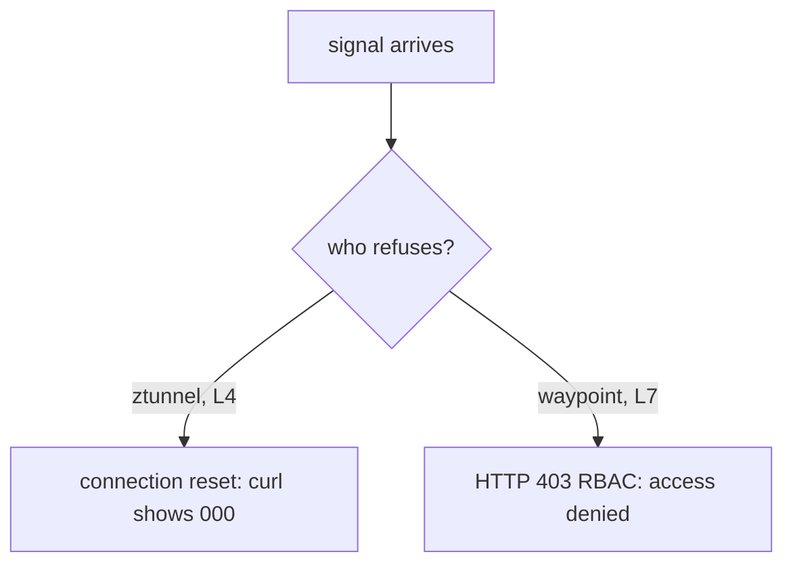

# What ztunnel Can Enforce

Astronaut, ztunnel ends the HBONE tunnel, so it sees the caller's certificate and the connection's addresses and ports. It sees nothing of the request inside. That one fact splits the fields of an `AuthorizationPolicy` into two groups. This part is about the group ztunnel can handle alone, and about the way an L4 refusal looks to the caller.

## Lock the supply ship to the flagship

Start with a real rule. The supply ship `cargo` should only answer the flagship `bridge`. Every other ship, including your `shuttle`, should be refused.

<!-- astrona:playground:renew -->

### Write the rule

The rule names the bridge's identity. That identity comes from its service account, `starfleet-bridge`.

Save this as `authorizationpolicy-cargo-l4.yaml`:

```yaml
apiVersion: security.istio.io/v1
kind: AuthorizationPolicy
metadata:
  name: cargo-l4
  namespace: starfleet
spec:
  selector:
    matchLabels:
      app: cargo
  action: ALLOW
  rules:
  - from:
    - source:
        principals:
        - cluster.local/ns/starfleet/sa/starfleet-bridge
```

Apply it:

```sh
kubectl apply -f authorizationpolicy-cargo-l4.yaml
```

```text
authorizationpolicy.security.istio.io/cargo-l4 created
```

The policy uses a label `selector`, exactly as in sidecar mode. It points at the `cargo` pods, and the ztunnel in front of those pods enforces it.

### Test it from the shuttle

Send a signal from the shuttle straight to `cargo`:

```sh
kubectl exec -n starfleet deploy/shuttle -- curl -s -o /dev/null -w "%{http_code}\n" --max-time 5 http://cargo:9080/details/0
```

```text
000
command terminated with exit code 56
```

`curl` prints `000` because no HTTP answer came back at all, and `kubectl exec` adds the line about exit code 56: `curl` saw the connection being cut. If you still get `200`, wait about a minute and send the signal again. A new rule takes up to a minute to reach live traffic, because connections that are already open keep the old rule.

The shuttle runs as the service account `shuttle`, not `starfleet-bridge`, so it is refused. And no waypoint exists. ztunnel enforced the rule on its own, because everything the rule needs was on the tunnel: the caller's identity.

### Test it through the bridge

Now ask the bridge for the item. The bridge's product API at `/api/v1/products/0` signals `cargo` behind the scenes, with the bridge's own identity:

```sh
kubectl exec -n starfleet deploy/shuttle -- curl -s -o /dev/null -w "%{http_code}\n" http://bridge:9080/api/v1/products/0
```

```text
200
```

`200`: the flagship still reaches the supply ship. The same `cargo` pod refused one caller and served another, based only on who was calling.

## The L4 field set

The test above worked because a `principals` rule needs nothing from inside the request. Here is the full list of what ztunnel can and cannot check.

### What ztunnel can and cannot read

| Field | ztunnel can enforce it | Why |
| --- | --- | --- |
| `from.source.principals` | **yes** | read from the caller's certificate on the tunnel |
| `from.source.namespaces` | **yes** | part of the same identity |
| `from.source.ipBlocks` | **yes** | the connection's source address |
| `to.operation.ports` | **yes** | the destination port of the connection |
| `to.operation.methods` | no | needs the HTTP request |
| `to.operation.paths` | no | needs the HTTP request |
| `to.operation.hosts` | no | needs the `Host` header |
| `from.source.requestPrincipals` | no | needs a checked JSON Web Token (JWT) |
| `when` on `request.headers[...]` or `request.auth.*` | no | needs the HTTP request |

The rule of thumb: if you can decide it from the outside of the capsule (who, from where, to which channel), ztunnel can do it. If you must open the capsule, you need a waypoint.

One detail about `ports`: ztunnel sees the port the connection reaches on the pod. For the `probe`, that is the container port `8080`, not the Service port `8000`.

## An L4 denial is a refused connection

Look at that `000` again. In sidecar mode a refused request always got a `403`, because the proxy read the request and wrote an HTTP answer. ztunnel has no HTTP layer, so it cannot write an answer. It closes the **connection** instead.

### Two ways to say no



ztunnel can only drop the connection, so `curl` prints `000`. A waypoint reads HTTP, so it answers with a `403` and the text `RBAC: access denied` (RBAC is role-based access control, Envoy's name for its authorization filter).

That gives you a quick way to read failures in an ambient namespace:

| What the caller sees | Who refused | Layer |
| --- | --- | --- |
| `000`, connection reset | ztunnel | L4 |
| `403` | a waypoint | L7 |
| any other answer | nobody: the app answered | none |

The status code tells you which component decided before you read a single policy. One side effect: **a caller cannot tell an L4 refusal from a ship that is down.** Both look like a broken connection. If a caller must know "you are not allowed" from "try later", it needs an L7 rule on a waypoint, which answers `403`.

### Read ztunnel's flight log

ztunnel writes a log line for every connection it closes. Read the last lines from the ztunnel pods and keep the ones about refusals:

```sh
kubectl logs -n istio-system ds/ztunnel --tail=20 | grep -i "policy"
```

```text
2026-10-09T11:39:41.876395Z	error	access	connection complete	src.addr=10.244.0.14:58564 src.workload="shuttle-7b5db664c-hmlqb" src.namespace="starfleet" src.identity="spiffe://cluster.local/ns/starfleet/sa/shuttle" dst.addr=10.244.0.8:15008 dst.hbone_addr=10.244.0.8:9080 dst.service="cargo.starfleet.svc.cluster.local" dst.workload="cargo-v1-6f787f8bd5-h2bpn" dst.namespace="starfleet" dst.identity="spiffe://cluster.local/ns/starfleet/sa/starfleet-cargo" direction="inbound" bytes_sent=0 bytes_recv=0 duration="0ms" error="connection closed due to policy rejection: allow policies exist, but none allowed"
```

The line names the caller's identity (`src.identity`), the ship it tried to reach (`dst.workload`) and the reason (`error=...`). The words "allow policies exist, but none allowed" mean an `ALLOW` policy selects `cargo` and no rule in it matched the shuttle. This is how you prove an L4 refusal came from a policy, and not from a ship that is down. If the playground has more than one node, `ds/ztunnel` reads only one ztunnel pod; this playground has one node.

## Common pitfalls

> [!WARNING]
> - **Expecting a `403` from an L4 refusal.** ztunnel closes the connection. `curl` shows `000` and exits with an error.
> - **Thinking identity needs a waypoint.** `principals` and `namespaces` come from the certificate on the tunnel. ztunnel enforces them alone.
> - **Using the Service port in a `ports` rule.** ztunnel sees the pod's port, for example `8080` for the probe, not `8000`.
> - **Reading a policy as enforced because it exists.** In ambient mode, always ask which component enforces it.

> *ztunnel enforces everything you can decide from the connection, identity included, and it refuses by closing the connection, so an L4 denial shows as `000`, not `403`.*

## Your mission: Allow Only Known Ships At L4

You can now write an identity rule that ztunnel enforces with no waypoint, and read the refused connection it gives. Now prove it in a graded mission: lock two ships of the Starfleet so that only the right callers can reach them, using L4 rules alone.

The mission runs in its own training solar system, so first pause your playground. Nothing in it is lost:

```sh
astrona stop ats-015-playground-060-01
```

Then start the mission:

```sh
astrona run --git git@github.com:astrona-io/ATS015.git -c sections/section-060/module-01/labs/lab-02
```

Read the task in [`question.md`](./labs/lab-02/question.md) and solve it on your own first. When you think you are done, send it for grading:

```sh
astrona submit -c sections/section-060/module-01/labs/lab-02
```

When the mission is done, remove it and wake your playground up again:

```sh
astrona destroy ats-015-lab-060-01-02
astrona start ats-015-playground-060-01
```
