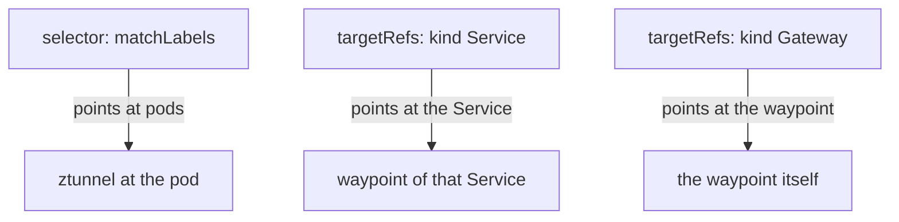

# An L7 Rule With No Waypoint

Add a field that ztunnel (the per-node proxy in ambient mode) cannot read, and Kubernetes still accepts the policy. There is no error, because `methods` is a valid field. Whether anything enforces it depends on how the policy is attached, and the two ways fail in opposite directions. This part shows both on purpose, because this is the most tested fact about ambient mode.

## An HTTP rule with no waypoint

Start with `probe`, an HTTP echo server. It echoes any method at `/anything`, so a method rule is easy to test. The rule says: only the `shuttle` workload may call `probe`, and only with `GET`.

<!-- astrona:playground:renew -->

### Write the rule the ambient way

Save this as `authorizationpolicy-probe-l7.yaml`:

```yaml
apiVersion: security.istio.io/v1
kind: AuthorizationPolicy
metadata:
  name: probe-l7
  namespace: starfleet
spec:
  targetRefs:
  - kind: Service
    group: ""
    name: probe
  action: ALLOW
  rules:
  - from:
    - source:
        principals:
        - cluster.local/ns/starfleet/sa/shuttle
    to:
    - operation:
        methods: ["GET"]
```

Apply it:

```sh
kubectl apply -f authorizationpolicy-probe-l7.yaml
```

```text
authorizationpolicy.security.istio.io/probe-l7 created
```

This policy has no `selector`. It uses `targetRefs` instead, which names the `probe` Service. The `group: ""` is the Kubernetes core API group, where `Service` lives.

### Send a GET and a POST

Send one request of each method from the `shuttle` pod:

```sh
kubectl exec -n starfleet deploy/shuttle -- curl -s -o /dev/null -w "GET:  %{http_code}\n" -X GET http://probe:8000/anything
kubectl exec -n starfleet deploy/shuttle -- curl -s -o /dev/null -w "POST: %{http_code}\n" -X POST http://probe:8000/anything
```

```text
GET:  200
POST: 200
```

Both get `200`, even a minute later. The `POST` should have been refused, and it was not.

### Ask the policy itself

List the policies, then read the status that `istiod` (Istio's control plane) writes on `probe-l7`:

```sh
kubectl get authorizationpolicy -n starfleet
kubectl get authorizationpolicy probe-l7 -n starfleet -o jsonpath='{.status.conditions}{"\n"}'
```

```text
NAME       ACTION   AGE
cargo-l4   ALLOW    81s
probe-l7   ALLOW    65s
[{"lastTransitionTime":"2026-10-09T11:39:50.365771477Z","message":"Service starfleet/probe is not bound to a waypoint","observedGeneration":"1","reason":"AncestorNotBound","status":"False","type":"WaypointAccepted"}]
```

The policy is listed next to `cargo-l4`, and it looks just as real. Its status shows the problem: the condition `WaypointAccepted` is `False`, with the reason `AncestorNotBound` and the message "Service starfleet/probe is not bound to a waypoint". `istioctl analyze -n starfleet` reports the same condition as warning `IST0171`. A `targetRefs` policy on a Service is meant for the waypoint in front of that Service. With no waypoint, no component takes it, so it is **accepted and ignored**.

## `targetRefs` or `selector`

The two ways to attach a policy point at different things. Getting this right is half of every ambient policy.

### What each one points at



A `selector` picks pods, and the ztunnel in front of those pods enforces it. That is the right form for L4 rules. A `targetRefs` entry of kind `Service` names the Service whose waypoint should hold the rule. A `targetRefs` entry of kind `Gateway` (with `group: gateway.networking.k8s.io`) names a waypoint directly, so the rule covers everything that waypoint serves.

L7 checks do not happen at the pod. They happen at the waypoint the request passes through. So L7 rules belong on `targetRefs`.

## The same rule with a selector

What if you write the HTTP rule the old sidecar way, with a `selector`? Then ztunnel is asked to enforce a field it cannot read. It does not ignore it. It **fails safe**: a rule it cannot check never matches, so an `ALLOW` with that rule allows nothing.

### Add a method to the cargo rule

Take the working `cargo-l4` rule and add a method to it. Save this as `authorizationpolicy-cargo-l4-get-only.yaml`:

```yaml
apiVersion: security.istio.io/v1
kind: AuthorizationPolicy
metadata:
  name: cargo-l4
  namespace: starfleet
spec:
  selector:
    matchLabels:
      app: cargo
  action: ALLOW
  rules:
  - from:
    - source:
        principals:
        - cluster.local/ns/starfleet/sa/starfleet-bridge
    to:
    - operation:
        methods: ["GET"]
```

Apply it:

```sh
kubectl apply -f authorizationpolicy-cargo-l4-get-only.yaml
```

```text
authorizationpolicy.security.istio.io/cargo-l4 configured
```

The `bridge` workload only ever sends `GET` to `cargo`, so on paper nothing should change.

### Call `bridge` again

Then check the result through the product API of `bridge`, which calls `cargo` for you:

```sh
kubectl exec -n starfleet deploy/shuttle -- curl -s -o /dev/null -w "%{http_code}\n" http://bridge:9080/api/v1/products/0
```

```text
500
```

Now `bridge` is refused too. Wait about a minute before you read the result: until the new rule reaches the open connections of `bridge`, you may still see `200`. Then the API of `bridge` answers `500`, because `cargo` no longer accepts connections from `bridge`. The ztunnel log shows the connection from `bridge` refused, with `src.identity="spiffe://cluster.local/ns/starfleet/sa/starfleet-bridge"` and the same reason as the earlier refusal of `shuttle`: "allow policies exist, but none allowed".

### See what ztunnel received

Ask ztunnel for the policy it holds, in full:

```sh
istioctl ztunnel-config policy -o json
```

```text
[
    {
        "name": "cargo-l4",
        "namespace": "starfleet",
        "scope": "WorkloadSelector",
        "action": "Allow",
        "rules": []
    }
]
```

This is the proof. ztunnel holds `cargo-l4`, but with **no rules at all**. The rule held a field ztunnel cannot check, so the whole rule was dropped, the `principals` part with it. An `ALLOW` policy with no rules matches nothing, so it refuses every caller.

So the two attachments fail in opposite ways:

| L7 field, no waypoint | What happens | How it looks |
| --- | --- | --- |
| attached with `targetRefs` | the rule is ignored | traffic flows as if the rule did not exist |
| attached with `selector` | ztunnel fails safe | the `ALLOW` matches nothing, every caller gets `000` |

### Put the working rule back

Apply the identity-only rule again, from the file you saved at the start of the cargo example:

```sh
kubectl apply -f authorizationpolicy-cargo-l4.yaml
```

```text
authorizationpolicy.security.istio.io/cargo-l4 configured
```

After about a minute, `bridge` reaches `cargo` again. Keep `probe-l7` in place: it is the rule a waypoint will bring to life.

## Common pitfalls

> [!WARNING]
> - **Trusting `kubectl get`.** An L7 rule with no waypoint is listed like any other. Check for a waypoint before you trust any method, path, header or token rule.
> - **Writing an L7 rule with a `selector`.** ztunnel cannot read the field and fails safe, so the `ALLOW` blocks every caller, including the ones you meant to allow.
> - **Expecting the API server or `istioctl analyze` to stop you.** `methods` is a valid field, so the object is accepted either way. `istioctl analyze` warns about a `targetRefs` policy with no waypoint (`IST0171`), but says nothing about an L7 field in a `selector` policy.
> - **Forgetting `group: ""` on a Service target.** `Service` lives in the core API group, which is the empty string.

> *An L7 rule with no waypoint does nothing when it uses `targetRefs`, and blocks everyone when it uses a `selector`: either way, it is not the rule you wrote.*
