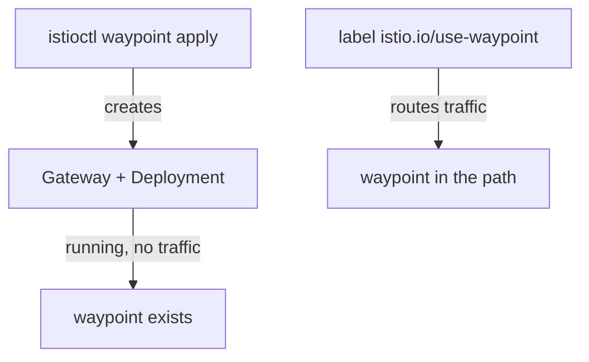
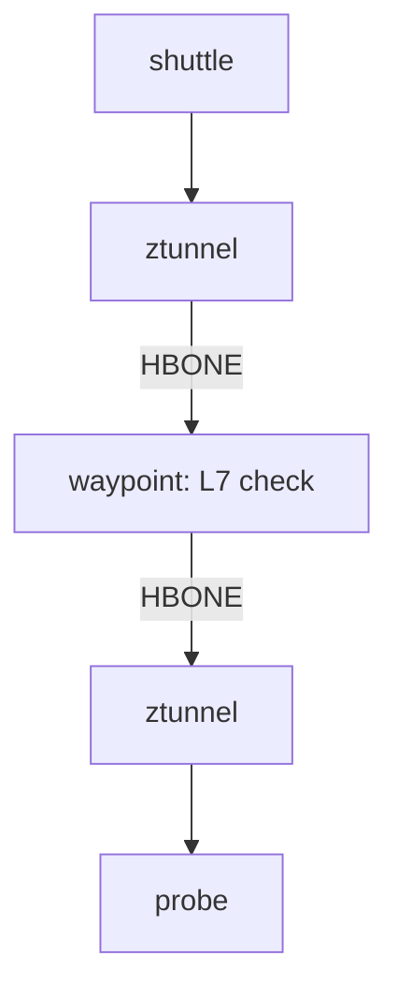

# Deploy A Waypoint

The `probe-l7` policy in `starfleet` says "only `shuttle`, and only `GET`", and right now nothing enforces it. It is attached with `targetRefs` to the `probe` Service, but no component in the request's path can read an HTTP method, so a `POST` from `shuttle` to `probe` still gets `200`. ztunnel, the per-node proxy, only sees connections, which is **L4** (layer 4, the transport layer). The method lives in the HTTP request, which is **L7** (layer 7, the application layer).

This chapter adds the one component that can read the method: a **waypoint**, an Envoy proxy you deploy in ambient mode to enforce L7 policy. You change nothing in the policy, and it starts to work. Along the way you meet a trap that waits for identity rules once a waypoint sits in the path.

## Two steps: create it, then send traffic through it

A waypoint needs two separate steps, and mixing them up is a classic way to lose an afternoon. The first step makes the waypoint exist. The second step sends traffic through it.



The diagram shows what each step does. `istioctl waypoint apply` creates a Gateway API `Gateway` with `gatewayClassName: istio-waypoint`, and Istio builds a Deployment and a Service for it. The waypoint now runs, but no traffic goes to it yet. The label `istio.io/use-waypoint`, on a namespace or a Service, is what sends traffic through it. A waypoint without that label looks healthy and receives nothing.

<!-- astrona:playground:renew -->

Start with the first step. Create a waypoint named `waypoint` in the `starfleet` namespace:

```sh
istioctl waypoint apply -n starfleet
```

```text
✅ waypoint starfleet/waypoint applied
```

Wait until it is ready, then list it:

```sh
kubectl wait --for=condition=Programmed gateway/waypoint -n starfleet --timeout=120s
kubectl get gateway -n starfleet
```

```text
gateway.gateway.networking.k8s.io/waypoint condition met
NAME       CLASS            ADDRESS        PROGRAMMED   AGE
waypoint   istio-waypoint   10.96.19.182   True         10s
```

`PROGRAMMED: True` means the waypoint pod runs and has its configuration from `istiod`, Istio's control plane. It is tempting to stop here, so send the `POST` again and see whether that is enough:

```sh
kubectl exec -n starfleet deploy/shuttle -- curl -s -o /dev/null -w "POST: %{http_code}\n" -X POST http://probe:8000/anything
```

```text
POST: 200
```

Still `200`. The waypoint exists, but traffic to `probe` does not go through it.

That is what the second step fixes. Label only the `probe` Service, so only requests to `probe` go through the waypoint:

```sh
kubectl label service probe -n starfleet istio.io/use-waypoint=waypoint
```

```text
service/probe labeled
```

Then check the result. ztunnel now knows that the `probe` Service has a waypoint:

```sh
istioctl ztunnel-config service | grep -E "NAMESPACE|starfleet"
```

```text
NAMESPACE    SERVICE NAME SERVICE VIP   WAYPOINT ENDPOINTS
starfleet    bridge       10.96.172.131 None     1/1
starfleet    cargo        10.96.51.86   None     1/1
starfleet    navcom       10.96.236.25  None     1/1
starfleet    probe        10.96.132.123 waypoint 2/2
starfleet    scout        10.96.164.117 None     3/3
starfleet    waypoint     10.96.19.182  None     1/1
```

The `WAYPOINT` column says `waypoint` for `probe` and `None` for every other Service. The waypoint has a Service of its own, which is why `waypoint` shows up as a line too. `cargo` still has no waypoint, so the identity rule `cargo-l4`, which allows only `starfleet-bridge` to reach `cargo`, keeps working at ztunnel exactly as before.

## Watch the same policy start to work

Nothing about `probe-l7` changed: same object, same rules, same `targetRefs`. The only change is that a component that can read HTTP is now in the request's path. Send one request of each method from the `shuttle` pod, exactly as before:

```sh
kubectl exec -n starfleet deploy/shuttle -- curl -s -o /dev/null -w "GET:  %{http_code}\n" -X GET http://probe:8000/anything
kubectl exec -n starfleet deploy/shuttle -- curl -s -o /dev/null -w "POST: %{http_code}\n" -X POST http://probe:8000/anything
```

```text
GET:  200
POST: 403
```

If the `POST` still gets `200`, wait about a minute and send it again: open connections keep the old path for a while. Then the `GET` passes and the `POST` gets **`403`**. That is an HTTP answer, written by the waypoint. A refusal from ztunnel looks different: it closes the connection, so `curl` shows `000`. In this one namespace you now have two refusals from two components.

To prove the waypoint made the decision, read its own log. The waypoint is an Envoy proxy, so it writes an access log line for every request:

```sh
kubectl logs -n starfleet deploy/waypoint --tail=2
```

```text
[2026-10-09T11:44:22.954Z] "GET /anything HTTP/1.1" 200 - via_upstream - "-" 0 429 4 2 "-" "curl/8.11.1" "a14f191d-9d63-41ac-bb83-315c4435fd46" "probe:8000" "envoy://connect_originate/10.244.0.15:8080" inbound-vip|8000|http|probe.starfleet.svc.cluster.local envoy://internal_client_address/ 10.96.132.123:8000 10.244.0.14:59462 - default
[2026-10-09T11:44:23.028Z] "POST /anything HTTP/1.1" 403 - rbac_access_denied_matched_policy[none] - "-" 0 19 0 - "-" "curl/8.11.1" "1227bbf1-aa5a-4818-aaac-f9ea2d7fdc3c" "probe:8000" "-" inbound-vip|8000|http|probe.starfleet.svc.cluster.local - 10.96.132.123:8000 10.244.0.14:59462 - default
```

The waypoint writes its log in batches, so if the lines are missing, wait a few seconds and run the command again. The `POST` line shows `403` and the reason `rbac_access_denied_matched_policy[none]`: no `ALLOW` rule matched it. The waypoint also checked the identity: it saw the certificate of `shuttle`, so the `principals` part of the rule still works here.

## The path with a waypoint

The policy works, but the request now travels a different path, and that path has a side effect. With a waypoint, the request makes one more hop, while ztunnel still does the L4 work at both ends.



The diagram shows the waypoint between the two ztunnels, joined by HBONE, the mutual TLS tunnel between proxies. The waypoint is the only part that reads HTTP. That is also the cost: one extra hop and one extra Envoy to run. Ambient mode lets you pay that cost only where you need it.

The extra hop also changes who the caller is. After the waypoint, the connection reaches the ztunnel of `probe` **from the waypoint**, so ztunnel at the destination sees the waypoint's identity, `cluster.local/ns/starfleet/sa/waypoint`, not the identity of `shuttle`.

That matters for L4 rules with a `selector`. Suppose you had labelled the whole namespace with `istio.io/use-waypoint=waypoint` (that is what `istioctl waypoint apply --enroll-namespace` does). Then requests to `cargo` would also go through the waypoint, and `cargo-l4`, which allows only `starfleet-bridge`, would refuse the waypoint. `cargo` would stop answering everyone, `bridge` included. We tried it in the playground: with the namespace label in place, ztunnel at `cargo` logged the refused caller as `spiffe://cluster.local/ns/starfleet/sa/waypoint`, and the waypoint answered the requests with `503`.

There are two ways out. You can keep identity rules on the waypoint with `targetRefs`, so the waypoint checks the real caller. Or you can also allow the waypoint's identity in the L4 rule. Per-service labels, as you used above, keep the problem away from services that need no waypoint.

That leads to the last choice: namespace or one service. `istioctl waypoint apply -n starfleet --enroll-namespace` creates the waypoint and labels the namespace in one go, so every Service in the namespace uses it. Labelling single Services, as you did, is the narrower choice: only the Services that need L7 rules pay for the extra hop. Either way, the policy's `targetRefs` stays the same, and the label decides whether traffic actually reaches the waypoint.

You can now bring an L7 rule to life: create the waypoint, label the Service, and the same `targetRefs` policy starts to answer `403`. You also know that the waypoint becomes the caller that the destination's ztunnel sees. What is still open is how to check, for any policy, which component holds it, so that a rule that does nothing never fools you.

## Common pitfalls

> [!WARNING]
> - **Creating a waypoint and stopping there.** `PROGRAMMED: True` only means it runs. Without the `istio.io/use-waypoint` label, no traffic goes through it.
> - **Missing the Gateway API CRDs.** A waypoint is a `Gateway`. Without the CRDs, `istioctl waypoint apply` fails.
> - **Keeping a pod-level identity rule behind a waypoint.** The destination's ztunnel then sees the waypoint's identity, so a rule that allows only the original caller refuses everyone.
> - **Removing a waypoint and forgetting its policies.** The L7 policies stay, stop being enforced, and still show in `kubectl get`.
