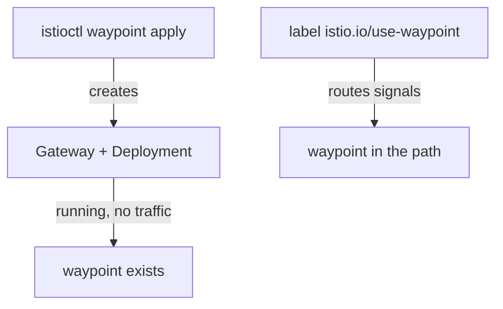
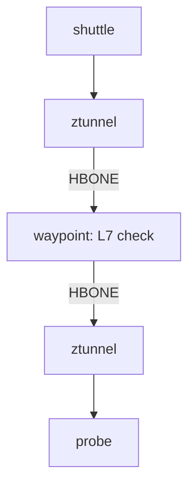

# Deploy A Waypoint

Astronaut, the `probe-l7` rule in `starfleet` says "only the shuttle, and only `GET`", and right now nothing enforces it: the shuttle's `POST` to the probe still gets `200`. This part adds the one component that can read the method, a waypoint. You change nothing in the policy, and it starts to work.

## Two steps: create it, then send traffic through it

A waypoint needs two separate steps, and mixing them up is a classic way to lose an afternoon. The first step makes the checkpoint exist. The second step tells the ships to stop at it.

### What each step does



`istioctl waypoint apply` creates a Gateway API `Gateway` with `gatewayClassName: istio-waypoint`, and Istio builds a Deployment and a Service for it. That checkpoint now runs, but no signal goes to it yet. The label `istio.io/use-waypoint`, on a namespace or a Service, is what sends signals through it. A waypoint without that label looks healthy and receives nothing.

<!-- astrona:playground:renew -->

### Create the waypoint

Create a waypoint named `waypoint` on the `starfleet` planet:

```sh
istioctl waypoint apply -n starfleet
```

```text
✅ waypoint starfleet/waypoint applied
```

Wait until it is ready, then list it:

```sh
kubectl wait --for=condition=Programmed gateway/waypoint -n starfleet --timeout=120s
kubectl get gateway -n starfleet
```

```text
gateway.gateway.networking.k8s.io/waypoint condition met
NAME       CLASS            ADDRESS        PROGRAMMED   AGE
waypoint   istio-waypoint   10.96.19.182   True         10s
```

`PROGRAMMED: True` means the waypoint pod runs and has its orders. Now send the `POST` again:

```sh
kubectl exec -n starfleet deploy/shuttle -- curl -s -o /dev/null -w "POST: %{http_code}\n" -X POST http://probe:8000/anything
```

```text
POST: 200
```

Still `200`. The checkpoint exists, but the probe's signals do not stop there.

### Send the probe's traffic through it

Label only the `probe` Service, so only signals to the probe go through the waypoint:

```sh
kubectl label service probe -n starfleet istio.io/use-waypoint=waypoint
```

```text
service/probe labeled
```

Then check the result. ztunnel now knows that the probe beacon has a waypoint:

```sh
istioctl ztunnel-config service | grep -E "NAMESPACE|starfleet"
```

```text
NAMESPACE    SERVICE NAME SERVICE VIP   WAYPOINT ENDPOINTS
starfleet    bridge       10.96.172.131 None     1/1
starfleet    cargo        10.96.51.86   None     1/1
starfleet    navcom       10.96.236.25  None     1/1
starfleet    probe        10.96.132.123 waypoint 2/2
starfleet    scout        10.96.164.117 None     3/3
starfleet    waypoint     10.96.19.182  None     1/1
```

The `WAYPOINT` column says `waypoint` for `probe` and `None` for every other beacon. The waypoint has a Service of its own, which is why `waypoint` shows up as a line too. `cargo` still has no waypoint, so the `cargo-l4` rule keeps working at ztunnel exactly as before.

## Watch the same policy start to work

Nothing about `probe-l7` changed: same object, same rules, same `targetRefs`. The only change is that a component that can read HTTP now stands in the signal's path.

### Send a GET and a POST

Send one signal of each method from the shuttle, exactly as before:

```sh
kubectl exec -n starfleet deploy/shuttle -- curl -s -o /dev/null -w "GET:  %{http_code}\n" -X GET http://probe:8000/anything
kubectl exec -n starfleet deploy/shuttle -- curl -s -o /dev/null -w "POST: %{http_code}\n" -X POST http://probe:8000/anything
```

```text
GET:  200
POST: 403
```

If the `POST` still gets `200`, wait about a minute and send it again: open connections keep the old path for a while. Then the `GET` passes and the `POST` gets **`403`**. That is an HTTP answer, written by the waypoint. Compare it with the `000` you get from ztunnel at `cargo`: two refusals, two components, one planet.

### Read the waypoint's flight log

The waypoint is an Envoy proxy, so it writes an access log line for every request:

```sh
kubectl logs -n starfleet deploy/waypoint --tail=2
```

```text
[2026-10-09T11:44:22.954Z] "GET /anything HTTP/1.1" 200 - via_upstream - "-" 0 429 4 2 "-" "curl/8.11.1" "a14f191d-9d63-41ac-bb83-315c4435fd46" "probe:8000" "envoy://connect_originate/10.244.0.15:8080" inbound-vip|8000|http|probe.starfleet.svc.cluster.local envoy://internal_client_address/ 10.96.132.123:8000 10.244.0.14:59462 - default
[2026-10-09T11:44:23.028Z] "POST /anything HTTP/1.1" 403 - rbac_access_denied_matched_policy[none] - "-" 0 19 0 - "-" "curl/8.11.1" "1227bbf1-aa5a-4818-aaac-f9ea2d7fdc3c" "probe:8000" "-" inbound-vip|8000|http|probe.starfleet.svc.cluster.local - 10.96.132.123:8000 10.244.0.14:59462 - default
```

The waypoint writes its log in batches, so if the lines are missing, wait a few seconds and run the command again. The `POST` line shows `403` and the reason `rbac_access_denied_matched_policy[none]`: no `ALLOW` rule matched it. The waypoint also checked the identity: it saw the shuttle's certificate, so the `principals` part of the rule still works here.

## The path with a waypoint

With a waypoint, the signal makes one more hop. ztunnel still does the L4 work at both ends.

### One more hop



The waypoint sits between the two ztunnels and is the only part that reads HTTP. That is also the cost: one extra hop and one extra Envoy to run. Ambient mode lets you pay that cost only where you need it.

### The waypoint becomes the caller

There is a trap here. After the waypoint, the signal reaches the probe's ztunnel **from the waypoint**, so ztunnel at the destination sees the waypoint's identity, `cluster.local/ns/starfleet/sa/waypoint`, not the shuttle's.

That matters for L4 rules with a `selector`. Suppose you had labelled the whole namespace with `istio.io/use-waypoint=waypoint` (that is what `istioctl waypoint apply --enroll-namespace` does). Then signals to `cargo` would also go through the waypoint, and `cargo-l4`, which allows only `starfleet-bridge`, would refuse the waypoint. `cargo` would stop answering everyone, the bridge included. We tried it in the playground: with the namespace label in place, ztunnel at `cargo` logged the refused caller as `spiffe://cluster.local/ns/starfleet/sa/waypoint`, and the waypoint answered the signals with `503`.

Two ways out: keep identity rules on the waypoint with `targetRefs`, so the waypoint checks the real caller; or also allow the waypoint's identity in the L4 rule. Per-service labels, as above, keep the problem away from services that need no waypoint.

### Namespace or one service

`istioctl waypoint apply -n starfleet --enroll-namespace` creates the waypoint and labels the namespace in one go, so every Service on the planet uses it. Labelling single Services, as you did, is the narrower choice: only the beacons that need L7 rules pay for the extra hop. Either way, the policy's `targetRefs` stays the same. The label decides whether signals actually reach the waypoint.

## Common pitfalls

> [!WARNING]
> - **Creating a waypoint and stopping there.** `PROGRAMMED: True` only means it runs. Without the `istio.io/use-waypoint` label, no signal goes through it.
> - **Missing the Gateway API CRDs.** A waypoint is a `Gateway`. Without the CRDs, `istioctl waypoint apply` fails.
> - **Keeping a pod-level identity rule behind a waypoint.** The destination's ztunnel then sees the waypoint's identity, so a rule that allows only the original caller refuses everyone.
> - **Removing a waypoint and forgetting its policies.** The L7 policies stay, stop being enforced, and still show in `kubectl get`.

> *A waypoint that exists is not a waypoint that receives traffic: create it, then label the namespace or Service, and only then do L7 rules work.*

## Your mission: Enforce L4 And L7 Policy In Ambient Mode

You can now create a waypoint, send a service's signals through it, and attach an L7 rule with `targetRefs`. Now prove it in a graded mission: in an ambient namespace, allow one client identity and one method on a service, and nothing else.

The mission uses its own small app (`notification-service` with two client pods), and it runs in its own training solar system. So first pause your playground. Nothing in it is lost:

```sh
astrona stop ats-015-playground-060-01
```

Then start the mission:

```sh
astrona run --git git@github.com:astrona-io/ATS015.git -c sections/section-060/module-01/labs/lab-01
```

Read the task in [`question.md`](./labs/lab-01/question.md) and solve it on your own first. When you think you are done, send it for grading:

```sh
astrona submit -c sections/section-060/module-01/labs/lab-01
```

When the mission is done, remove it and wake your playground up again:

```sh
astrona destroy ats-015-lab-060-01
astrona start ats-015-playground-060-01
```
