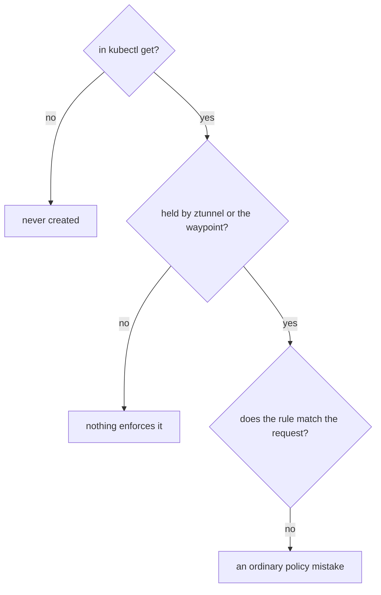
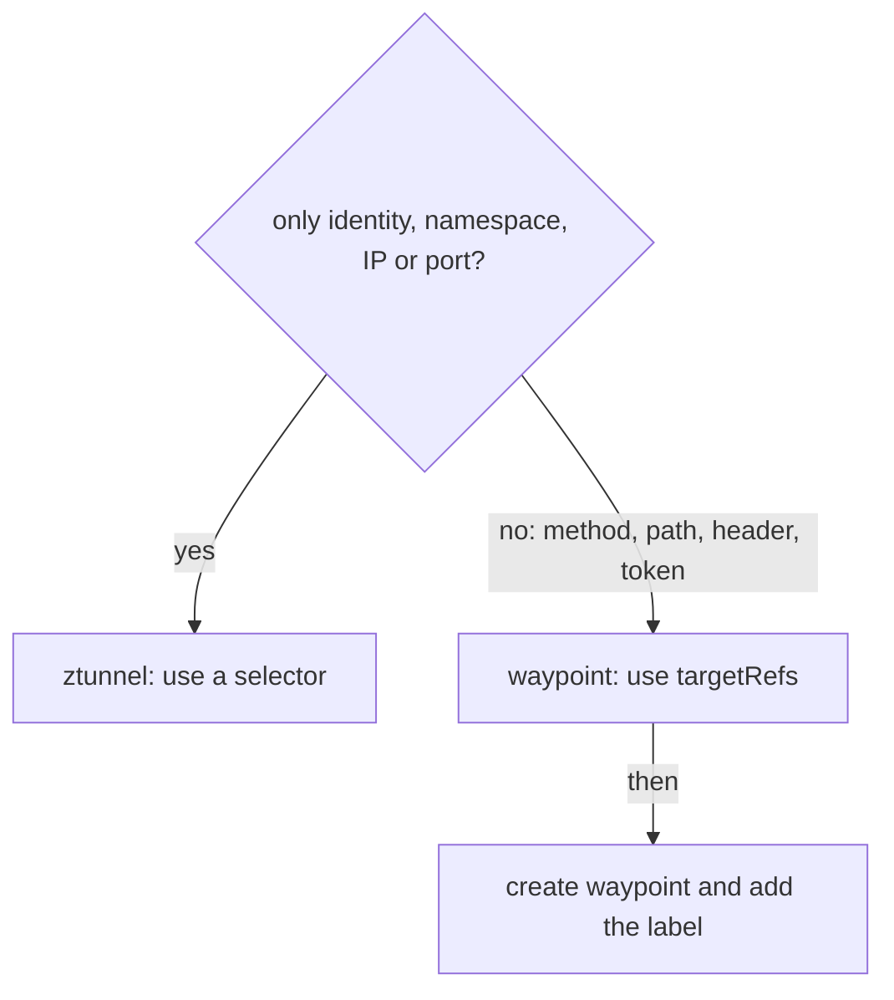

# Find Which Component Enforces A Rule

Ambient mode has two places that enforce policy. ztunnel is the per-node proxy that checks connections, which is **L4** (layer 4, the transport layer). The waypoint is an Envoy proxy you deploy to check HTTP requests, which is **L7** (layer 7, the application layer). A policy that neither of them holds does nothing, however real it looks in `kubectl get`.

So when a policy seems to do nothing, the first question is no longer "does my rule match?". It is "which component holds this rule, if any?". This chapter shows you how to ask each component what it holds, gives you a short check for "my policy does nothing", and ends with what stays exactly as it was in sidecar mode.

## Commands that inspect ambient mode

In sidecar mode you read the configuration of a pod's sidecar proxy with `istioctl proxy-config`. There is no sidecar now, so ztunnel has its own command family, `istioctl ztunnel-config`. Each sidecar command has a ztunnel partner that answers the same question:

| Sidecar mode | Ambient mode | The question |
| --- | --- | --- |
| `istioctl proxy-config clusters <pod>` | `istioctl ztunnel-config workload` and `... service` | what does it know about? |
| `istioctl proxy-config secret <pod>` | `istioctl ztunnel-config certificate` | which certificates does it hold? |
| `istioctl proxy-config listeners <pod>` | `istioctl ztunnel-config policy` | which policies does it enforce? |

A waypoint is an ordinary Envoy proxy. So you still read it with `istioctl proxy-config` and `kubectl logs`, pointed at the waypoint's Deployment instead of at an app pod.

The commands below need this state in the playground: the policies `cargo-l4` (an identity rule with a `selector` on `cargo`) and `probe-l7` (a method rule with `targetRefs` on the `probe` Service), a waypoint named `waypoint`, and the `probe` Service labelled `istio.io/use-waypoint=waypoint`.

<!-- astrona:playground:renew -->

Start by comparing two lists: the policies ztunnel enforces, and the policies Kubernetes stores.

```sh
istioctl ztunnel-config policy
kubectl get authorizationpolicy -n starfleet
```

```text
NAMESPACE POLICY NAME ACTION SCOPE
starfleet cargo-l4    Allow  WorkloadSelector
NAME       ACTION   AGE
cargo-l4   ALLOW    4m57s
probe-l7   ALLOW    4m41s
```

The two lists do not match, and that is correct. ztunnel holds only `cargo-l4`, the rule with a `selector`. `probe-l7` uses `targetRefs`, so it lives on the waypoint. The useful reading is the difference: a policy that shows in `kubectl get` but that no component holds is a policy nothing will ever enforce. Add `-o json` to the ztunnel command to see the rules ztunnel kept for each policy: an empty `"rules": []` means ztunnel dropped every rule it could not check.

That leaves `probe-l7` to account for. Ask the waypoint for its listeners (the parts of Envoy that accept connections on a port) and pull out the names of the authorization rules in them:

```sh
istioctl proxy-config listener deploy/waypoint -n starfleet -o json | grep -o 'ns\[starfleet\]-policy\[[a-z0-9-]*\]' | sort -u
```

```text
ns[starfleet]-policy[probe-l7]
```

The waypoint holds `probe-l7` and nothing else. Between the two commands, every policy in the namespace is accounted for: one at ztunnel, one at the waypoint.

## When a policy does nothing

With two places to enforce, the old question "does my rule match?" gets a new step before it. Ask three questions in order, and stop at the first "no".



The diagram shows the order of the checks. The first question checks that the object exists. The second is new in ambient mode: an L7 rule with no waypoint, a waypoint with no `istio.io/use-waypoint` label, or the wrong attachment form all stop here. The third is the usual policy check: the identity string, the namespace, the method. Most ambient surprises are solved at the second question.

> [!TIP]
> For a `targetRefs` policy, read the status conditions on the policy object before anything else. A `WaypointAccepted` condition of `False` answers the second question in one line: no waypoint takes this policy.

## What stays the same as in sidecar mode

The check above is new, but most of what you know about Istio security still holds in ambient mode. Only the place where a rule is enforced changes:

| Topic | In ambient mode |
| --- | --- |
| Workload identity | the same: one certificate per service account, named `cluster.local/ns/<namespace>/sa/<service-account>` |
| `PeerAuthentication` | still applies, and ztunnel does the mutual TLS; traffic between enrolled pods is already mutual TLS over HBONE |
| Policy structure | the same: `selector` or `targetRefs`, `action`, `rules`; an `ALLOW` refuses everything it does not allow |
| Evaluation order | the same: `CUSTOM`, then `DENY`, then `ALLOW`, at whichever component enforces the rule |
| JWT (`RequestAuthentication`, `requestPrincipals`) | the same objects, and all of it needs a waypoint, because a token travels inside the request |
| Ingress gateways and edge TLS | unchanged: a gateway is an Envoy proxy whatever mode the pods behind it use |
| `ipBlocks` | works at L4, so ztunnel can enforce it too |

In the table, HBONE is the mutual TLS tunnel between ztunnels, and a JWT (JSON Web Token) is a signed token that carries claims about the end user. The one new thing to learn is the L4 and L7 split, and how each kind of rule attaches.

That split gives you one habit to take into every ambient task. Before you write a policy, decide which layer it needs:



The diagram shows the decision. If every field is about the connection, ztunnel enforces it and a `selector` is enough. If any field needs the inside of the request, the rule needs a waypoint, `targetRefs`, and the `istio.io/use-waypoint` label, or it is decoration.

You can now account for every policy in an ambient namespace. `istioctl ztunnel-config policy` shows what ztunnel holds, and the waypoint's listeners and log show what the waypoint holds. When a policy does nothing, you check that it exists, that a component holds it, and only then that it matches. Everything else about Istio security works as it did with sidecars.

## Common pitfalls

> [!WARNING]
> - **Running `istioctl proxy-config` on an app pod.** There is no sidecar to answer. Use `istioctl ztunnel-config` for ztunnel, and point `proxy-config` at the waypoint.
> - **Expecting a `targetRefs` policy in ztunnel's list.** Waypoint policies live on the waypoint. Check its listeners or its access log instead, and read the policy's `WaypointAccepted` status condition.
> - **Assuming an L7 `DENY` covers every path.** A request that never reaches the waypoint is never checked by it. Put the connection part of a requirement in an L4 rule.
> - **Forgetting that JWT rules need a waypoint.** A token is part of the request, so ztunnel cannot check it.
