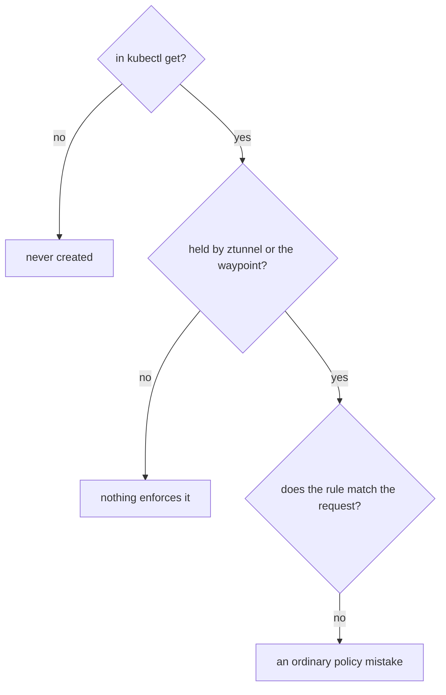
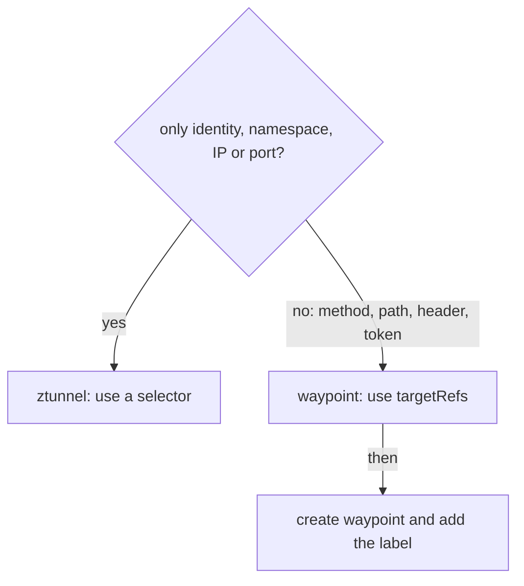

# Find Which Component Enforces A Rule

Ambient mode has two places that enforce policy: ztunnel (the per-node proxy) and the waypoint (an Envoy proxy you deploy for L7, that is HTTP, rules). A policy that neither of them holds does nothing, however real it looks in `kubectl get`. This part shows you how to ask each component what it holds, gives you a short check for "my policy does nothing", and lists what stays exactly as it was in sidecar mode.

## Commands that inspect ambient mode

In sidecar mode you read the configuration of a pod's sidecar proxy with `istioctl proxy-config`. There is no sidecar now, so ztunnel has its own command family, `istioctl ztunnel-config`.

### Which command answers which question

| Sidecar mode | Ambient mode | The question |
| --- | --- | --- |
| `istioctl proxy-config clusters <pod>` | `istioctl ztunnel-config workload` and `... service` | what does it know about? |
| `istioctl proxy-config secret <pod>` | `istioctl ztunnel-config certificate` | which certificates does it hold? |
| `istioctl proxy-config listeners <pod>` | `istioctl ztunnel-config policy` | which policies does it enforce? |

A waypoint is an ordinary Envoy proxy. So you still read it with `istioctl proxy-config` and `kubectl logs`, pointed at the waypoint's Deployment instead of at an app pod.

The commands below need the playground in the state the waypoint steps left it: the `cargo-l4` and `probe-l7` policies, a waypoint named `waypoint`, and the `probe` Service labelled `istio.io/use-waypoint=waypoint`.

<!-- astrona:playground:renew -->

### Compare the policy lists

List the policies ztunnel enforces, then the policies Kubernetes stores:

```sh
istioctl ztunnel-config policy
kubectl get authorizationpolicy -n starfleet
```

```text
NAMESPACE POLICY NAME ACTION SCOPE
starfleet cargo-l4    Allow  WorkloadSelector
NAME       ACTION   AGE
cargo-l4   ALLOW    4m57s
probe-l7   ALLOW    4m41s
```

The two lists do not match, and that is correct. ztunnel holds only `cargo-l4`, the rule with a `selector`. `probe-l7` uses `targetRefs`, so it lives on the waypoint. The useful reading is the difference: a policy that shows in `kubectl get` but that no component holds is a policy nothing will ever enforce. Add `-o json` to the ztunnel command to see the rules ztunnel kept for each policy: an empty `"rules": []` means ztunnel dropped every rule it could not check.

### Look at the waypoint's half

Ask the waypoint for its listeners and pull out the names of the authorization rules in them:

```sh
istioctl proxy-config listener deploy/waypoint -n starfleet -o json | grep -o 'ns\[starfleet\]-policy\[[a-z0-9-]*\]' | sort -u
```

```text
ns[starfleet]-policy[probe-l7]
```

The waypoint holds `probe-l7` and nothing else. Between the two commands, every policy in the namespace is accounted for: one at ztunnel, one at the waypoint.

## When a policy does nothing

With two places to enforce, the old question "does my rule match?" gets a new step before it. Ask the three questions below in order, and stop at the first "no".

### Three questions in order



The first question checks that the object exists. The second is new in ambient mode: an L7 rule with no waypoint, a waypoint with no `istio.io/use-waypoint` label, or the wrong attachment form all stop here. The third is the usual policy check: the identity string, the namespace, the method. Most ambient surprises are solved at the second question.

## What stays the same as in sidecar mode

Most of what you know about Istio security still holds in ambient mode. Only the place where a rule is enforced changes.

### Facts that do not change

| Topic | In ambient mode |
| --- | --- |
| Workload identity | the same: one certificate per service account, named `cluster.local/ns/<namespace>/sa/<service-account>` |
| `PeerAuthentication` | still applies, and ztunnel does the mutual TLS; traffic between enrolled pods is already mutual TLS over HBONE |
| Policy structure | the same: `selector` or `targetRefs`, `action`, `rules`; an `ALLOW` refuses everything it does not allow |
| Evaluation order | the same: `CUSTOM`, then `DENY`, then `ALLOW`, at whichever component enforces the rule |
| JWT (`RequestAuthentication`, `requestPrincipals`) | the same objects, and all of it needs a waypoint, because a token travels inside the request |
| Ingress gateways and edge TLS | unchanged: a gateway is an Envoy proxy whatever mode the pods behind it use |
| `ipBlocks` | works at L4, so ztunnel can enforce it too |

The one new thing to learn is the L4 and L7 split, and how each kind of rule attaches.

### The habit to take away

Before you write an ambient policy, decide which layer it needs:



If every field is about the connection, ztunnel enforces it and a `selector` is enough. If any field needs the inside of the request, the rule needs a waypoint, `targetRefs`, and the `istio.io/use-waypoint` label, or it is decoration.

## Common pitfalls

> [!WARNING]
> - **Running `istioctl proxy-config` on an app pod.** There is no sidecar to answer. Use `istioctl ztunnel-config` for ztunnel, and point `proxy-config` at the waypoint.
> - **Expecting a `targetRefs` policy in ztunnel's list.** Waypoint policies live on the waypoint. Check its listeners or its access log instead, and read the policy's `WaypointAccepted` status condition.
> - **Assuming an L7 `DENY` covers every path.** A request that never reaches the waypoint is never checked by it. Put the connection part of a requirement in an L4 rule.
> - **Forgetting that JWT rules need a waypoint.** A token is part of the request, so ztunnel cannot check it.

> *Ask which layer a rule needs before you write it: identity, namespace, IP and port work at ztunnel, and everything else needs a waypoint that exists and receives the traffic.*
